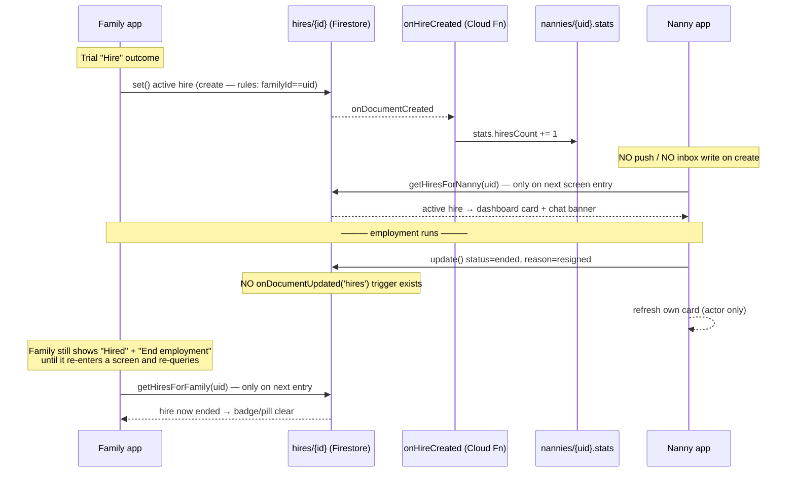
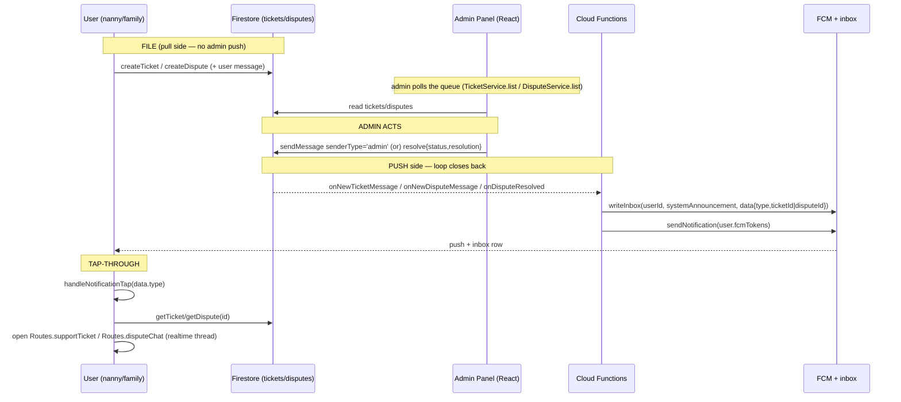

**Focus areas:** ① Post‑hire · ② Two‑way rating · ③ Support ticketing & reporting
**Depth:** Full‑stack — Flutter (nanny + family) · Cloud Functions · Firestore · React admin panel
**Date:** 2026‑07‑21 · **Mode:** analysis only (no code changed)

---

## Why this audit

Kafi runs **two mirror‑image client experiences** — the **nanny flow** and the **family flow** — on top of one shared Firebase backend. The two apps never talk to each other directly. They connect only through **shared Firestore documents** that both sides read, and **Cloud Functions** that react to a write on one side and produce the effect the other side eventually sees (a denormalized field, an inbox notification, an aggregated rating).

This document traces that connective tissue for the three stages that happen **after a family and a nanny have matched** — the parts of the product where the two flows are most tightly coupled and where "it looks done on one side" most often hides "the other side never hears about it."

## The connection pattern (shared across all three stages)

Every one of the three areas is built from the same three‑part shape:

| Stage | Shared document(s) | Cloud Function bridge | How the *other* side sees it |
|---|---|---|---|
| **① Post‑hire** | `hires/{id}` (`hire_<trialId>`) | `onHireCreated` (stat bump) | one‑shot query on screen entry → My‑Jobs pill / dashboard card / chat banner |
| **② Rating** | `reviews/{reviewerId_revieweeId}` | `onReviewCreated` → `stats.ts` aggregation | denormalized `stats.averageRating` on the reviewee's `nannies/`/`families/` doc |
| **③ Support / report** | `tickets/{id}` · `disputes/{id}` (+ `messages/` subcollection) | `onNewTicketMessage` · `onNewDisputeMessage` · `onDisputeResolved` | inbox notification + FCM push → tap‑through opens the thread |

The recurring lesson of the audit is that **the shared doc is usually written correctly, but the bridge (notification / realtime / reverse‑direction) is only half‑built** — so the connection between the two flows is frequently one‑directional.

## Status legend

Each traced sub‑flow is rated for how well the nanny↔family (or user↔admin) connection actually closes:

- **WORKING** — both sides connected and consistent.
- **PARTIAL** — one direction works; the reverse or a refresh path is missing.
- **MOCK‑ONLY** — behaves in mock but diverges live (or vice‑versa).
- **BROKEN** — the connection does not close.

Findings are also tagged **Critical / Major / Minor** by user impact.

## How to read this document

- **Sections 1–3** each trace one stage end‑to‑end: creation → cross‑side representation → lifecycle/status → the connection mechanism → notifications → Firestore rules → admin → gaps.
- **Section 4** is the cross‑cutting synthesis: the shared failure modes, a per‑stage connection‑health verdict, a consolidated prioritized findings table, and a recommended iteration plan for the "few iterations" of changes to follow.

> Every claim is anchored to a `file:line` reference so any point can be verified against the source directly.


---

# 1. Post-Hire Flow — Nanny ↔ Family Connection

**Scope:** what happens once a family hires a nanny, and how the two sides stay
connected through the employment. The single connecting artifact is one Firestore
document per employment: `hires/{hireId}`. Everything else (badges, banners,
status cards, the nanny stat) is a projection of that doc.

**One-line summary:** A family creates `hires/{id}` at the end of a "Hire" trial
outcome; both sides read it back with **one-shot queries on screen entry** (there
is no realtime listener on `hires`); either party ends it with a client-side
status flip; a single Cloud Function (`onHireCreated`) bumps the nanny's lifetime
`stats.hiresCount`, and **nothing else server-side reacts to hires** — no push, no
inbox, no end-trigger.

---

## 1.1 The connecting artifact — `HireModel` / `hires/{id}`

`kafi_app/lib/models/hire_model.dart`

| Field | Type | Notes |
|---|---|---|
| `id` | String | Deterministic: `hire_{trialId}` (see 1.2) — one hire per trial |
| `familyId` | String | Family uid; the only party allowed to `create` (rules) |
| `nannyId` | String | Nanny **user id** = `nannies/{uid}`; `getHiresForNanny` matches on it (`hire_model.dart:49`) |
| `jobPostId` | String? | Nullable — null for browse/chat-initiated hires (gap 1.11-C) |
| `trialId` | String? | The trial this hire came from |
| `employmentType` | String | `'live-in' \| 'live-out'`, copied from `trial.trialType` |
| `salaryAed` | int | `0` = not set. **Never populated by any code path** (dead) |
| `status` | `HireStatus` | `active \| ended` (`hire_model.dart:17`) |
| `endReason` | `HireEndReason?` | `resigned \| terminated \| completed` (`hire_model.dart:21`) |
| `startedAt` / `endedAt` | DateTime | `endedAt` set server-side on end |
| `endNote` | String? | Free-text end reason. **Never populated by UI** (dead) |
| `nannyName` / `familyName` | String? | Denormalized at create so each side renders without a lookup |

`isActive => status == HireStatus.active` (`hire_model.dart:75`) is the predicate
every UI surface filters on.

**Identity chain (load-bearing, and it holds):** `NannyModel.id = user.id = nannies/{uid}`
(`nanny_profile_controller.dart:196-197`) → `NannyCardModel.fromNanny` copies
`id: n.id` (`nanny_card_model.dart:49`) → the family offers a trial with that id →
`_createHireFromTrial` copies `hire.nannyId = t.nannyId` → the nanny signs in and
`getHiresForNanny(user.id)` matches. Card id, trial nannyId, hire nannyId and chat
`thread.nannyId` are all the same uid, so the projections line up.

---

## 1.2 Hire creation — how a hire comes to exist

There is exactly **one** creation path. Despite the interface comment implying a
generic capability, `createHire` is called from a single site.

### Path A (the only live path): trial "Hire" outcome → `hires/{id}`

`kafi_app/lib/controllers/trial_controller.dart`

1. Family completes a trial and taps the **Hire** outcome. `setOutcome(TrialStatus.completed, outcomeLabel:'hired')` runs (`trial_controller.dart:504`).
2. Guarded gate at `trial_controller.dart:518`:
   `if (s == TrialStatus.completed && outcomeLabel == 'hired' && isFamily) await _createHireFromTrial(t);`
   — so a hire is only ever minted by the **family**, only from a **completed**
   trial (design: hiring is reachable only after a trial — `hire_model.dart:22-26`).
3. `_createHireFromTrial` (`trial_controller.dart:546-575`) builds the `HireModel`
   with `id: 'hire_${t.id}'`, `status: active`, `startedAt: now`, denormalized
   `nannyName`/`familyName`, then `await _hires.createHire(hire)` (`:560`).
   It is fully defensive — a hire-write failure only shows a toast, never throws
   (the trial is already completed).
4. Side-effect in the same method: it flips the matching `application` to `hired`
   via `_apps.markHired` (`:571`) so the family's Applicants list shows the badge.

### Deterministic id = idempotency

`FirestoreHireService.createHire` (`firestore_hire_service.dart:9-18`) recomputes
`id = 'hire_${trialId}'` and does a `.set()`. A double-tap of "Hire" lands on the
**same** doc (`i_hire_service.dart:8-10`). Mock mirrors this by removing any prior
doc with that id first (`mock_hire_service.dart:12-14`).

### "Direct-hire" path — does not exist

There is no browse/chat "Hire now" button and no non-trial `createHire` caller
(grep confirms only `_createHireFromTrial` calls it). A hire **always** originates
from a completed trial. A trial offered from browse/chat (no linked application)
still produces a hire, but with `jobPostId == null` — which has a UI consequence
(gap 1.11-C).

---

## 1.3 Active-hire representation on each side

Both sides derive their view from the same `hires` query, filtered to `isActive`,
loaded **once on screen entry**.

| | Family side | Nanny side |
|---|---|---|
| **Home/list surface** | Green "Hired with {name}" pill on the job card, `my_jobs_screen.dart:212-219`, keyed by `hireForJob(job.id)` (`family_jobs_controller.dart:54-55`) | Employment status card on the dashboard, `nanny_dashboard_screen.dart:243-339`, from `controller.activeHire.value` |
| **Data source** | `FamilyJobsController.load()` → `getHiresForFamily(fid)`, filtered `isActive` (`family_jobs_controller.dart:42-44`) | `NannyProfileController.loadEmploymentStatus()` → `activeHireForNanny(user.id)` (`nanny_profile_controller.dart:213-227`) |
| **Chat list badge** | "Hired" badge + purple pill on the thread card, `chat_screen.dart:263, 358-368, 389-398` | Same widget (shared `ChatScreen`), role-aware |
| **Chat header pill** | `chat_screen.dart:645-702` (`_chatTopbar`, `hired` pill) | Same |
| **Chat conversation banner** | Purple `_hireBanner` with **End employment** action, `chat_screen.dart:605-608, 798-832` | Same banner with **Resign** label (role-aware via `controller.isNanny`) |
| **Chat data source** | `ChatController._loadActiveHires(id)` → `getHiresForFamily`, mapped by counterparty nannyId (`chat_controller.dart:216-228`) | same method → `getHiresForNanny`, mapped by counterparty familyId |
| **Extra end control** | (only the chat banner) | Also a **Resign** link inside the dashboard status card (`nanny_dashboard_screen.dart:312-333`) |

**Family has no dedicated "My Hires" screen** (confirmed: no `views/family/*hire*`
file). The family's only surfaces are the My-Jobs pill and the chat badges/banner.
`getHiresForFamily` is used in exactly two controllers (`family_jobs_controller`,
`chat_controller`).

The chat list explicitly treats "on trial" and "hired" as mutually exclusive —
a hire only exists after the trial completes, which clears the trial flags
(`chat_screen.dart:262-263`).

---

## 1.4 Hire lifecycle / status transitions

```
          _createHireFromTrial (family, trial "Hire" outcome)
                        │  status = active
                        ▼
                 ┌──────────────┐
                 │  active      │
                 └──────┬───────┘
        family taps     │      nanny taps
     "End employment"   │      "Resign"
   (endActiveHire,      │   (endActiveHire OR resignHire)
    reason=terminated)  │    reason=resigned
                        ▼
                 ┌──────────────┐
                 │  ended       │  endedAt=serverTimestamp, endReason set
                 └──────────────┘
```

**Two end call sites, three reasons in the model, only two ever used:**

- Family **ends** / nanny **resigns** from the **chat banner**:
  `ChatController.endActiveHire(t)` (`chat_controller.dart:51-75`). Reason is
  hardcoded by role: `isNanny ? resigned : terminated` (`:56-57`).
- Nanny **resigns** from the **dashboard card**: `NannyProfileController.resignHire()`
  (`nanny_profile_controller.dart:231-247`), reason always `resigned`.
- Both call `IHireService.endHire(hireId, reason, note?)`.
  `FirestoreHireService.endHire` (`firestore_hire_service.dart:43-54`) writes:
  `status: 'ended'`, `endReason`, `endNote` (always null from UI), and
  `endedAt: FieldValue.serverTimestamp()`.

**Fields that flip:** `status active→ended`, `endReason null→(resigned|terminated)`,
`endedAt null→now`. `HireEndReason.completed` and `endNote` are **supported by the
model / service / rules but never produced by any screen** — the confirm dialog
(`chat_screen.dart:834-853`) offers no reason picker and no note field (gap 1.11-D).

There is **no reopen / no "ended" history view**. Once ended, the hire vanishes
from every surface (all filter `isActive`) and is effectively invisible to both
users thereafter.

---

## 1.5 The connection mechanism — how one side's change reaches the other

The `hires/{id}` doc is the shared state. But **the read model is polling, not
realtime** — `IHireService` exposes no `watch*` stream (only `Future`-returning
getters), and `FirestoreHireService` never calls `.snapshots()` (grep: the only
`collection('hires')` reference builds one-shot queries). Every surface refreshes
by calling its loader again on entry / manual action:

- Family My-Jobs: `load()` in `onInit` + pull-to-refresh (`my_jobs_screen.dart:37`).
- Family/Nanny chat: `_loadActiveHires` runs only inside `refreshThreads()`
  (`chat_controller.dart:190`), which the live **threads** stream does **not**
  re-invoke on hire changes.
- Nanny dashboard: `loadEmploymentStatus()` in `_bootstrap` (onInit) + after resign.

### Sequence: create + end, and the stale-counterparty problem



ASCII view of the same connection (steady state):

```
   FAMILY                         hires/{id}                        NANNY
  ┌────────┐    create (rules:   ┌───────────┐   read on entry    ┌────────┐
  │My Jobs │─── familyId==uid ──▶│ familyId  │◀── getHiresFor ────│Dashboard│
  │ pill   │                     │ nannyId   │    Nanny(uid)      │  card   │
  │Chat    │◀── read on entry ──▶│ status    │◀── read on entry ─▶│ Chat    │
  │banner  │  getHiresForFamily  │ endReason │  _loadActiveHires  │ banner  │
  └────────┘  _loadActiveHires   └─────┬─────┘                    └────────┘
       ▲  update: either party can flip │ status→ended
       └──────── endHire() ─────────────┘   (no realtime fan-out; no end trigger)
```

### `firestore.rules` for hires (`firestore.rules:252-263`)

```
match /hires/{hireId} {
  allow read:   if isAdmin() || (isSignedIn() &&
                   (existing().familyId == request.auth.uid
                    || existing().nannyId == request.auth.uid));
  allow create: if isSignedIn() && incoming().familyId == request.auth.uid;   // family only
  allow update: if isAdmin() || (isSignedIn() &&
                   (existing().familyId == request.auth.uid
                    || existing().nannyId == request.auth.uid));               // either party
  allow delete: if isAdmin();
}
```

Both parties read; **only the family creates**; either party updates (that is how
the nanny can resign / the family can terminate). Note the create rule validates
**only** `familyId == uid` — not that a completed trial exists, that `nannyId` is a
real nanny, or that `status == 'active'` (gap 1.11-E).

---

## 1.6 Notifications on hire create / end

| Event | Cloud Function | Push (FCM)? | Inbox doc? | Result |
|---|---|---|---|---|
| Hire **created** | `onHireCreated` (`triggers/stats.ts:96-104`) | **No** | **No** | Only `nannies/{id}.stats.hiresCount += 1` |
| Hire **ended** | **none** (no `onDocumentUpdated('hires')` — `index.ts` has no such export) | **No** | **No** | Nothing server-side reacts |

`onHireCreated` (`stats.ts:96-104`) is the **only** server reaction to the entire
hires collection. It exists purely to own the nanny stat the rules forbid the
family from writing.

The inbox type `'hired'` **exists on both ends but is dead**:
- Defined in the `InboxType` union (`functions/src/utils/notifications.ts:83`) but
  **never passed to `writeInbox`** anywhere.
- The Flutter enum `NotificationType.hired` exists (`notification_model.dart:13`)
  and its tap handler is a **no-op `return`** (`notification_controller.dart:215`).

Contrast with trials, which are fully wired: `onTrialOffered`, `onTrialResponse`,
`onTrialEnded` all call `writeInbox` + `sendNotification` (`triggers/trial.ts`).
The hire flow was scaffolded to the same shape and then **left unconnected**.

**Consequence:** the nanny is never told she was hired, and neither side is told
the hire ended — they discover both only by re-opening a screen that re-queries.

---

## 1.7 Caps / continuation

- **Nanny concurrency cap = 2 total "jobs"** (active hires + accepted/active
  trials), enforced only at **trial-accept** time, nanny-side:
  `_nannyAtJobCap()` (`trial_controller.dart:577-592`) blocks `acceptTrial`
  (`:349`) when `activeHires + activeTrials >= 2`. There is **no** dedicated
  "one active hire" cap and **no** family-side cap (a family may hire many
  nannies, one per job).
- Because the cap allows 2 active hires, but `activeHireForNanny` returns the
  **first** active hire (`firestore_hire_service.dart:34-40`), the nanny dashboard
  can only represent one of two simultaneous hires (chat keys by counterparty so
  both still show there).
- **Re-hire:** possible only via a **new** trial (new `trialId` → new
  `hire_{trialId}` doc). No re-hire button on an ended hire.
- **Continuation logic:** none. No renewal, no contract term, no auto-expiry.
  `stats.hiresCount` is **increment-only** (never decremented on end) — a lifetime
  count, acceptable semantically but note it (1.11-E).

---

## 1.8 Admin panel

Admin has **no hires view and no hire actions**. Grep of `admin-panel/` finds only
the derived aggregate `stats.hiresCount`:
- Read-only display on the nanny profile: `NannyProfileView.tsx:306`
  `<Field label="Hires" value={String(nanny.stats.hiresCount ?? 0)} />`.
- Type + mock seed data in `services/firestore.ts` (`hiresCount?: number`, and an
  `'hired'` application-status literal at `:236`).

There is no `hires` collection listing, no ability for admin to end/inspect an
employment. Admin sees only the lifetime count on the nanny record. (Rules do
grant admin full read/update/delete on `hires`, so the capability is available —
just no UI consumes it.)

---

## 1.9 Hand-off to ratings (link only; ratings is a separate audit)

The hire flow prompts a review at **two** moments via the shared
`showReviewDialog` (`views/family/review_dialog.dart:13`):

1. **At hire creation (family→nanny):** `setOutcome` on a completed trial opens the
   review dialog for the nanny (`trial_controller.dart:532-539`). This is really
   the *trial-completion* review, which fires on the same tap that creates the hire.
2. **At hire end (both directions):**
   - Family terminates → review the nanny; nanny resigns via chat → review the
     family (`chat_controller.dart:64-71`).
   - Nanny resigns via dashboard → review the family
     (`nanny_profile_controller.dart:238-243`).

`showReviewDialog` no-ops if the pair was already reviewed
(`review_dialog.dart:25`), and the review folds into the reviewee's rating
server-side via `onReviewCreated` (`triggers/stats.ts:119`). The prompt is
**actor-only** — the counterparty who did **not** end the hire is never invited to
review (and isn't even notified the hire ended).

---

## 1.10 End-to-end trace (condensed)

**Family hires:** trial screen → `setOutcome(completed, 'hired')`
(`trial_controller.dart:504`) → `_createHireFromTrial` (`:546`) →
`FirestoreHireService.createHire` set `hires/hire_{trialId}` (`:9`) →
`onHireCreated` bumps `hiresCount` (`stats.ts:96`) → family review dialog for nanny.

**Nanny sees it:** next time she opens the dashboard, `_bootstrap` →
`loadEmploymentStatus` → `activeHireForNanny` (`nanny_profile_controller.dart:217`)
paints the green "Hired" card; opening chat, `_loadActiveHires`
(`chat_controller.dart:216`) paints the hired badge + banner.

**Either side ends it:** chat banner **End/Resign** → `_confirmEndHire`
(`chat_screen.dart:834`) → `endActiveHire` (`chat_controller.dart:51`) → `endHire`
update flips `status→ended` (`firestore_hire_service.dart:48`) → actor refreshes +
gets a review dialog. **Counterparty** keeps showing "Hired" until it re-queries.

---

## 1.11 Current state & gaps

### What works
- Deterministic, idempotent creation (`hire_{trialId}`) — safe against double-tap
  and re-render; mock and Firestore agree (`firestore_hire_service.dart:9`,
  `mock_hire_service.dart:8`).
- Denormalized `nannyName`/`familyName` render both sides with no extra lookup.
- Correct trust boundary: family-only create, either-party end, nanny stat owned
  server-side by `onHireCreated` (`firestore.rules:252-263` + `stats.ts:96`).
- Role-aware end semantics (terminate vs resign) and a clean ratings hand-off for
  the actor.
- Consistent identity chain (card id == user id == `hires.nannyId`) so projections
  line up across trials, chat, and hires.

### Gaps / bugs

| # | Severity | Finding (file:line) | Recommendation |
|---|---|---|---|
| **A** | **High** | Nanny is **never notified she was hired**. `onHireCreated` only increments a stat (`functions/src/triggers/stats.ts:96-104`); the `'hired'` inbox type is defined but never written (`utils/notifications.ts:83`) and its Flutter handler no-ops (`notification_controller.dart:215`). | In `onHireCreated`, add `writeInbox(nannyId,'hired',…)` + `sendNotification(nanny.fcmTokens,…)`, mirroring `onTrialOffered` (`triggers/trial.ts:36-49`). |
| **B** | **High** | **No hire-end trigger and no realtime on hires.** No `onDocumentUpdated('hires/{id}')` exists (`index.ts` exports none); reads are one-shot on entry (`chat_controller.dart:216`, `family_jobs_controller.dart:42`, `nanny_profile_controller.dart:217`). The counterparty keeps a stale "Hired" badge + a live "End employment" button after the other side ends. | Add `onHireEnded` (`onDocumentUpdated`) to notify + inbox the counterparty; and/or add `IHireService.watchActiveHire*` streams so both sides update live like chat threads do. |
| **C** | **Med-High** | **Browse/chat-initiated hire is invisible on family My Jobs.** `hireForJob` matches by `jobPostId` (`family_jobs_controller.dart:54-55`); a hire from a trial with no linked application has `jobPostId == null` (`trial_controller.dart:554`), so it shows in chat only. | Add a "Current hires" section on My Jobs that lists `getHiresForFamily` where `isActive` regardless of `jobPostId` (don't rely on the job join). |
| **D** | **Med** | **`HireEndReason.completed` and `endNote` are dead from the UI.** The model/service/rules support them (`hire_model.dart:21,66`; `firestore_hire_service.dart:48`), but the confirm dialog hardcodes reason by role and passes no note (`chat_screen.dart:834-853`; `chat_controller.dart:56-57`). | Either add a reason/note picker to the end dialog, or drop the unused `completed`/`endNote` fields to keep the model honest. |
| **E** | **Med** | **`hires` create rule doesn't validate trial linkage or status**, and `hiresCount` is never decremented. A signed-in family can fabricate an `active` hire for any `nannyId` and inflate the nanny's lifetime count (`firestore.rules:257`; `stats.ts:96-104` increment-only). | Tighten the create rule (require `status=='active'`, `nannyId` exists, optionally a matching completed trial); document `hiresCount` as lifetime, or decrement it in an end trigger if it should mean "active." |
| **F** | **Low** | **Second active hire is under-represented.** The cap permits 2 concurrent jobs (`trial_controller.dart:588`) but `activeHireForNanny` returns only the first (`firestore_hire_service.dart:34-40`), so the dashboard card can hide one. | Either enforce a strict single-active-hire cap, or make the dashboard render a list of active hires. |
| **G** | **Low** | **Double-end / idempotency.** `endHire` is a blind `update` (`firestore_hire_service.dart:43-54`); if the stale counterparty also taps End, it overwrites `endReason`/`endedAt` with the second actor's values. | Guard `endHire` with a `status == 'active'` precondition (transaction or rule) so the first end wins. |
| **H** | **Low** | **No employment history.** Every surface filters `isActive`, so an ended hire disappears entirely for both users; there is no record they can see. | Add a lightweight "Past employment" list (nanny profile / family My Jobs) reading ended hires. |


---

# 2. Two-Way Rating & Review Flow — Nanny ↔ Family Connection

## 2.1 TL;DR

Kafi has **one** review data model, **one** generic review dialog, and **one**
Cloud Function that together support ratings in **both** directions:

- **Family → Nanny** — folds into `nannies/{id}.stats.averageRating / reviewsCount`
- **Nanny → Family** — folds into `families/{id}.stats.averageRating / reviewsCount`

The bridge is the `reviews` collection + the `onReviewCreated` Cloud Function
(`functions/src/triggers/stats.ts:119`), which routes each review to the correct
collection by its `revieweeType`. The mechanism is **symmetric server-side** and
**asymmetric client-side**:

1. The **nanny's** aggregate rating is displayed in 4 places (family browse card,
   locked/unlocked profile, nanny's own dashboard, admin). The **family's**
   aggregate rating — although computed and stored identically by the same CF —
   is displayed **nowhere in the mobile app**, only in the admin panel. A nanny
   never sees a family's rating.
2. After a **trial** completes, only the **family** is prompted (to rate the
   nanny). The nanny is never invited to rate the family post-trial.
3. After a **hire** ends, only the **party who ends it** is prompted; the
   counterparty is never asked. A hire therefore yields at most one review.
4. `IReviewService.getReviewsFor` (the query that returns review *text*) has
   **zero callers in the app** — the review comments are collected but never
   displayed to any user.

---

## 2.2 Review Data Model & Service

### Model — `kafi_app/lib/models/review_model.dart`

| Field          | Type       | Notes |
| -------------- | ---------- | ----- |
| `id`           | `String`   | Deterministic `reviewerId_revieweeId` (assigned by the service, not the caller). |
| `reviewerId`   | `String`   | The author's user id. |
| `reviewerType` | `String`   | `'family'` or `'nanny'` — the direction's *from* side (`review_model.dart:4`). |
| `revieweeId`   | `String`   | Subject's user id. |
| `revieweeType` | `String`   | `'family'` or `'nanny'` — the direction's *to* side; **this is the field the CF routes on** (`review_model.dart:6`). |
| `trialId`      | `String?`  | Links a review to the trial that produced it. **Nullable, and there is NO `hireId` field** — hire-end reviews carry `trialId: null` and have no link back to the hire. |
| `rating`       | `int`      | 1–5 (`review_model.dart:8`). |
| `comment`      | `String?`  | Optional free text (≤400 chars, enforced in the dialog). |
| `createdAt`    | `DateTime` | Overwritten with `serverTimestamp()` on write. |
| `isPublic`     | `bool`     | Defaults `true` (`review_model.dart:23`). No code path ever sets it `false`. |

> The task brief expected `relatedTrialId/hireId` and a `direction` field. Reality:
> there is only `trialId` (no hire link), and "direction" is expressed implicitly
> by the `reviewerType`/`revieweeType` pair, not a single enum.

### Service interface — `kafi_app/lib/services/interfaces/i_review_service.dart`

```
submitReview(ReviewModel)              // create, deterministic id, one per pair/direction
getReviewsFor(String revieweeId)       // PUBLIC reviews only, newest-first
hasReviewed(String reviewerId, revieweeId)  // dedupe guard
```

### Firebase impl — `kafi_app/lib/services/firebase/firestore_review_service.dart`

- **Deterministic id** `reviewerId_revieweeId` (`:8`, `:15`). Because the id embeds
  the *direction*, a family→nanny review (`fam_nanny`) and a nanny→family review
  (`nanny_fam`) are **separate docs** and can coexist. Re-submitting the same
  direction is a doc *update*, which the rules deny (create-only), so it is
  blocked; the app also guards up-front with `hasReviewed`.
- **`getReviewsFor`** (`:24-43`) queries `where('revieweeId'==) + where('isPublic'==true)`
  then sorts client-side. The `isPublic==true` filter is the prior fix noted in the
  brief — it makes a third-party read satisfy the security rules (see §2.7). Two
  equality filters ⇒ no composite index required (and none exists in
  `firestore.indexes.json`).
- **`hasReviewed`** (`:46-49`) = a single `doc(pairId).get().exists`.

### Mock impl — `kafi_app/lib/services/mock/mock_review_service.dart`

In-memory list; `getReviewsFor` filters `r.isPublic` (`:19`); `submitReview`
removes any prior review for the same (reviewer, reviewee) before adding (`:11-13`).
Registered in `kafi_app/lib/bindings/initial_binding.dart:71` (mock) / `:89` (firebase).

---

## 2.3 When / Where a Review Is Prompted

All four call sites funnel through the single generic entry point
`showReviewDialog(...)` in `views/family/review_dialog.dart:13`.

| # | Trigger event | Call site | Prompted party | Reviewee (`revieweeType`) | `trialId`? |
| - | ------------- | --------- | -------------- | ------------------------- | ---------- |
| 1 | Trial marked **completed** | `controllers/trial_controller.dart:532-539` | **Family only** (`isFamily` gate, `:532`) | nanny | ✅ `t.id` |
| 2 | Hire ended in chat — **family terminates** | `controllers/chat_controller.dart:68-71` | Family | nanny | ❌ null |
| 3 | Hire ended in chat — **nanny resigns** | `controllers/chat_controller.dart:65-67` | Nanny | family | ❌ null |
| 4 | Hire **resigned from dashboard** | `controllers/nanny_profile_controller.dart:239-243` | Nanny | family | ❌ null |

`endActiveHire` (`chat_controller.dart:51-75`) is role-aware: whoever is signed in
ends the hire and is then invited to rate the counterparty (`if (isNanny) …
revieweeType: 'family' else … revieweeType: 'nanny'`).

### Asymmetries (this is the core of the audit)

- **Trial path is one-directional.** `trial_controller.setOutcome` only prompts
  when `s == completed && isFamily` (`:518`, `:532`). The nanny finishing the same
  trial is **never** asked to rate the family. So trial-derived family ratings can
  never exist.
- **Hire path is "ender-only".** Only the party who clicks *End hire / Resign* is
  prompted (#2–#4). The counterparty is never invited, so each ended hire yields
  **at most one** review, and which direction depends purely on who ended it.
- Net effect: **family→nanny** reviews are reachable via 2 flows; **nanny→family**
  reviews are reachable via 2 flows — but never as a *pair* on the same
  relationship, and never from a trial.

---

## 2.4 The Review Dialog — `kafi_app/lib/views/family/review_dialog.dart`

- **Generic / two-way.** Despite living under `views/family/`, it is used by nanny
  flows too (`chat_controller`, `nanny_profile_controller` import it). Params:
  `revieweeId`, `revieweeType`, `revieweeName?`, `trialId?` (`:13-18`).
- **Subject** = `revieweeId`; title `AppStrings.reviewTitle` = "How was @name?"
  (`review_dialog.dart:99-113`, `l10n/locales/en_us.dart:124`), falling back to
  "your nanny" / "this family" when no name is passed.
- **Dedupe guard** (`:24-28`): calls `hasReviewed(me.id, revieweeId)`; if already
  reviewed → silent return (no dialog). Any *exception* during the check also
  returns silently, so a failed lookup never throws into a hire-end flow that
  already succeeded.
- **Capture** (`:58-95`): star rating (default **5**, `:59`), optional comment
  (`maxLength 400`, empty → stored as `null`). `reviewerType` derived from
  `me.isNanny` (`:78`). `isPublic` left at its `true` default — **no UI to make a
  review private**.
- **Submit** (`:69-95`): builds `ReviewModel(id:'')` → `submitReview` →
  success toast (`reviewThanks`) or, on any throw, a failure toast
  (`reviewFailed`) and re-enables the button. Duplicate/permission errors surface
  as the generic failure toast.

---

## 2.5 Cloud Function Aggregation — `functions/src/triggers/stats.ts`

`onReviewCreated` (`stats.ts:119-138`) is the two-way aggregator:

```
onReviewCreated (onDocumentCreated 'reviews/{reviewId}')
  ├─ collection = revieweeCollection(review.revieweeType)   // stats.ts:108-112
  │        'nanny'  → 'nannies'
  │        'family' → 'families'
  │        else     → undefined  ⇒ bail
  ├─ guard: collection && revieweeId && Number.isFinite(rating)   // :125
  └─ txn on {collection}/{revieweeId}:
        stats = nextAverage(stats.averageRating, stats.reviewsCount, rating)  // :134
        set(..., {merge:true})
```

- **`nextAverage`** (`stats.ts:13-25`) folds one rating into the running average:
  `averageRating = (avg*count + rating)/(count+1)`, rounded to 2 dp; `reviewsCount = count+1`.
  Pure & unit-tested (`functions/test/stats.test.js`).
- **Exact fields written:** `{collection}/{revieweeId}.stats.averageRating` (double)
  and `.stats.reviewsCount` (int), merged. **Nothing else** — in particular the CF
  does **NOT** touch `profileScore`.
- **Idempotency caveat:** the CF fires on *create* and blindly folds the rating in.
  Because ids are deterministic per direction, a genuine second review is blocked
  by rules, so double-counting on retry is unlikely — but a re-created doc after an
  admin delete would re-increment (no reconciliation logic). Low severity.

### profileScore is NOT rating-derived

The brief asked whether a review recomputes `profileScore`. It does not.
`profileScore` is computed **client-side** in
`nanny_profile_controller.dart:1054 calculateProfileScore()` purely from *profile
completeness* (name, photos, intro video, experience, references, documents) — no
rating input. Moreover `firestore_user_service.dart:88` strips `profileScore` from
client writes as "server-owned", yet **no Cloud Function ever writes it** ⇒
`profileScore` is effectively only an in-memory value and is never persisted from
the server. (Tangential to ratings, but a real wiring gap.)

---

## 2.6 Where Ratings Surface

### Nanny's rating (well-wired — 4 surfaces)

| Surface | File:line | Renders |
| ------- | --------- | ------- |
| Family browse / unlocked profile stats row | `views/family/profile_sections.dart:14-27` | `4.8★` or `—` + reviews count |
| Family relocked profile | `views/family/profile_relocked_screen.dart:98-102` | same |
| **Nanny's own dashboard** ("Your rating") | `views/nanny/nanny_dashboard_screen.dart:161-168` | `stats.averageRating` |
| Card model plumbing | `models/nanny_card_model.dart:64-65` | from `n.stats.averageRating/reviewsCount` |
| Admin nanny profile | `admin-panel/src/components/nanny/NannyProfileView.tsx:311` | aggregate only |

Source of truth: `NannyStats.averageRating` (`models/nanny_model.dart:160-170`),
written by the CF.

### Family's rating (half-wired — model + admin only)

| Surface | File:line | Status |
| ------- | --------- | ------ |
| Model field | `models/family_model.dart:131-144` (`FamilyStats.averageRating`) | Parsed from Firestore; comment even says "Rating a family receives from nannies … maintained server-side by onReviewCreated". |
| Admin family detail | `admin-panel/src/pages/families/FamilyDetail.tsx:247-248, 353-361` | Shows avg + full review list (read-only). |
| **Any nanny-facing app screen** | — | **MISSING.** No widget reads a family's `averageRating`. Confirmed: the nanny's `job_detail_screen.dart` / `jobs_home_screen.dart` show family info but **no rating**. |

> **Confirmed gap (b):** the family's rating is written by the same CF that writes
> the nanny's, is present on `FamilyModel`, but is **never displayed to a nanny**.
> A nanny cannot see how a family is rated when deciding whether to apply / accept
> a trial. The write side exists; the read side was never built.

### Review *text* surfaces nowhere in-app

`getReviewsFor` has **no caller** anywhere in `kafi_app/lib` (verified by grep —
only the interface/impls reference it). The app shows the aggregate number/count
but never lists a single review comment to families or nannies. Only the admin
panel lists individual reviews, via its own reimplementation
(`admin-panel/src/services/firestore.ts:1207 ReviewService.listForReviewee`).

---

## 2.7 Visibility (`isPublic`)

`firestore.rules` — `reviews` block (`firestore.rules:237-245`):

```
read:  isAdmin
    || (signedIn && (isPublic == true          // any signed-in user
                     || reviewerId == uid       // author
                     || revieweeId == uid))     // subject
create: signedIn && incoming.reviewerId == uid  // author only, create-only
update/delete: isAdmin                          // moderation is admin-only
```

- `getReviewsFor` adds the matching `isPublic==true` predicate so a third-party
  read is rule-legal *before* it runs (a client-only filter would be rejected).
  This is the "getReviewsFor isPublic fix" the brief referenced.
- **But** `isPublic` is `true` for every review the app can create (dialog default,
  no private toggle), so the private branch and the reviewer/reviewee read
  exceptions are currently dead paths. Reviewer/reviewee can *see their own*
  private reviews per the rule, but none are ever private.

---

## 2.8 The Connection Mechanism (how the two flows join)

```
                     ┌──────────────────────────┐
   Family rates ───► │   reviews/{pairId}       │ ◄─── Nanny rates
   nanny             │   reviewerType/           │      family
   revieweeType:     │   revieweeType carry the  │      revieweeType:
   'nanny'           │   DIRECTION               │      'family'
                     └────────────┬─────────────┘
                                  │ onDocumentCreated
                                  ▼
                     onReviewCreated (stats.ts:119)
                       revieweeCollection(revieweeType)
                          /                     \
              'nanny' → 'nannies'          'family' → 'families'
                    │                              │
                    ▼                              ▼
        nannies/{id}.stats.*            families/{id}.stats.*
        averageRating, reviewsCount     averageRating, reviewsCount
                    │                              │
                    ▼                              ▼
        Shown to family + nanny         Shown ONLY in admin panel
        (§2.6, 4 surfaces)              (NOT to any nanny)  ◄── GAP
```

- The **shared `reviews` collection** is the single store for both directions;
  the deterministic-id-per-direction scheme keeps them as distinct docs.
- The **security rules forbid a reviewer from writing the reviewee's profile doc**
  (nannies/families update rules gate on `isUser(...)`/admin), so the aggregate can
  only be written by the CF. This is *why* the CF is the mandatory bridge — the
  client physically cannot update the counterparty's score.
- A family's review of a nanny updates the **nanny's** public score; a nanny's
  review of a family updates the **family's** score — same CF, same code path,
  differing only by `revieweeType` routing.

---

## 2.9 Admin Panel

Read-only, and **asymmetric**:

| Admin view | Reviews shown? | Ref |
| ---------- | -------------- | --- |
| Family detail | ✅ avg rating + **full review list** | `admin-panel/src/pages/families/FamilyDetail.tsx:118-119, 247, 353-361` |
| Nanny detail | ⚠️ **aggregate number only** (no list) | `NannyProfileView.tsx:311`; `NannyDetail.tsx` does **not** import `ReviewService` |
| Moderation actions | ❌ none in UI | rules allow admin `update/delete` (`firestore.rules:244`) but no button exists |

`ReviewService` (`admin-panel/src/services/firestore.ts:1207-1237`) offers
`listForReviewee` + `averageFor`; only `FamilyDetail` consumes it. So admins can
read a *family's* incoming reviews in full but only see a *nanny's* average — the
inverse blind spot of the mobile app. No approve/hide/delete review UI anywhere.

---

## 2.10 Sequence Diagram — review → CF → profile display (both directions)

```mermaid
sequenceDiagram
    autonumber
    participant Fam as Family (app)
    participant Nan as Nanny (app)
    participant RV as reviews/{pairId}
    participant CF as onReviewCreated (stats.ts)
    participant NDoc as nannies/{id}.stats
    participant FDoc as families/{id}.stats
    participant UI as Profile / Dashboard

    rect rgb(235,245,255)
    note over Fam,UI: DIRECTION A — Family → Nanny (trial complete OR family ends hire)
    Fam->>Fam: setOutcome(completed)/endActiveHire()  (trial_controller:532 / chat_controller:68)
    Fam->>RV: showReviewDialog(revieweeType:'nanny') → submitReview  (review_dialog:74)
    RV-->>CF: onDocumentCreated
    CF->>CF: revieweeCollection('nanny')='nannies'; nextAverage()
    CF->>NDoc: set stats.averageRating / reviewsCount (merge)
    NDoc-->>UI: family stats row + nanny "Your rating"  (profile_sections:21, nanny_dashboard:167)
    end

    rect rgb(255,240,245)
    note over Nan,UI: DIRECTION B — Nanny → Family (nanny resigns hire)
    Nan->>Nan: resignHire()/endActiveHire()  (nanny_profile_controller:239 / chat_controller:65)
    Nan->>RV: showReviewDialog(revieweeType:'family') → submitReview
    RV-->>CF: onDocumentCreated
    CF->>CF: revieweeCollection('family')='families'; nextAverage()
    CF->>FDoc: set stats.averageRating / reviewsCount (merge)
    FDoc--xUI: NOT rendered on any nanny-facing screen  ✗ GAP (§2.6)
    FDoc-->>UI: admin FamilyDetail only  (FamilyDetail:247)
    end
```

The two directions are **structurally identical through the CF** and diverge only
at the final "display" hop: Direction A reaches real user-facing UI; Direction B
dead-ends at the admin panel.

---

## 2.11 Current State & Gaps

### ✅ Works
- Two-way aggregation is correct and symmetric server-side — `onReviewCreated`
  routes both `revieweeType`s and writes the right `stats.*`
  (`functions/src/triggers/stats.ts:108-138`).
- Deterministic per-direction ids let both directions coexist and enforce one
  review per pair per direction (`firestore_review_service.dart:8-21`).
- Nanny's rating is fully surfaced (family card, profile, own dashboard, admin)
  (`profile_sections.dart:14-27`, `nanny_dashboard_screen.dart:161-168`).
- Rules correctly make the aggregate server-owned and reviews create-only +
  public-readable (`firestore.rules:237-245`); `getReviewsFor` matches the rule
  with its `isPublic==true` filter (`firestore_review_service.dart:30-33`).
- Dialog dedupe + error handling are sound and never throw into the caller
  (`review_dialog.dart:24-28, 90-94`).

### ⚠️ Half-wired
- **Family rating written but never read by nannies.** `FamilyStats.averageRating`
  is computed by the CF and parsed on the model, but no nanny-facing screen renders
  it. → *Add a family rating chip to the nanny's `job_detail_screen.dart` (and
  application/chat headers) reading `family.stats.averageRating`.*
  Ref: `kafi_app/lib/models/family_model.dart:143` (written) vs
  `kafi_app/lib/views/nanny/job_detail_screen.dart` (no read).
- **Review text is collected but never displayed in-app.** `getReviewsFor` has
  zero callers. → *Build a "Reviews" list on the nanny profile (family-facing) and
  on the nanny dashboard, calling `getReviewsFor(revieweeId)`.*
  Ref: `kafi_app/lib/services/interfaces/i_review_service.dart:12` (uncalled).
- **Admin review coverage is inverted.** Family detail lists reviews; nanny detail
  shows only the average. → *Reuse `ReviewService.listForReviewee` on `NannyDetail`.*
  Ref: `admin-panel/src/pages/nannies/NannyDetail.tsx` (no `ReviewService` import).

### ❌ Missing
- **Trial path never prompts the nanny.** Only the family is asked after a trial
  completes, so a nanny→family review from a trial is impossible. → *In
  `setOutcome`, when the signed-in user is the nanny and the trial is completed,
  call `showReviewDialog(revieweeType:'family', revieweeId: t.familyId)`.*
  Ref: `kafi_app/lib/controllers/trial_controller.dart:518-539`.
- **Hire path prompts only the ender.** The counterparty of an ended hire is never
  invited. → *After a hire ends, notify/prompt both parties (e.g. an inbox
  "Rate your …" deep-link that opens `showReviewDialog` for the other side).*
  Ref: `kafi_app/lib/controllers/chat_controller.dart:64-71`.
- **No `hireId` on the review model.** Hire-end reviews store `trialId:null` and
  cannot be traced back to the hire. → *Add `hireId` to `ReviewModel` and pass it
  from the hire-end call sites.* Ref: `kafi_app/lib/models/review_model.dart:7`.

### 🐞 Bugs / smells
- **Wrong copy for the nanny→family direction.** `reviewSubtitle` = "Your rating
  helps other families." is shown to a nanny rating a family too. → *Make the
  subtitle direction-aware.* Ref: `kafi_app/lib/l10n/locales/en_us.dart:125` used
  at `review_dialog.dart:117`.
- **`profileScore` is "server-owned" but no server writes it.** Stripped from
  client saves yet only computed in memory client-side; never persisted by a CF.
  → *Either compute it in a CF or stop stripping it client-side.*
  Ref: `firestore_user_service.dart:88` vs `nanny_profile_controller.dart:1054`.
- **Dialog is misfiled under `views/family/`** though nanny flows depend on it.
  → *Move to `views/shared/` to reflect its two-way use.* Ref:
  `kafi_app/lib/views/family/review_dialog.dart:13` (imported by
  `chat_controller.dart:23`, `nanny_profile_controller.dart`).
- **CF re-folds on re-create with no reconciliation** (low sev, mitigated by
  deterministic ids + create-only rule). Ref: `stats.ts:128-137`.


---

# 3. Support Ticketing & Dispute/Reporting Flow — Nanny ↔ Family ↔ Admin

This flow spans **two parallel, structurally-identical subsystems** that both close the
loop between an app user and the human admin team:

| Subsystem | What it is | Collection | About | Filed from |
| --- | --- | --- | --- | --- |
| **Support tickets** | User ↔ admin help conversation | `tickets` | The user's own account/payment/trial/hiring/technical issue | Settings → Support → "New ticket" |
| **Disputes / reports** | User ↔ admin conduct/payment report **about the counterparty** | `disputes` | Another user (`reportedUserId`) | Chat top-bar flag, Trial screen "Report a problem", Trial payment-issue dialog |

Both are symmetric for **nanny and family** (identical controllers/services/screens are
bound in *both* role bindings), and both reach admin through the **admin panel queue** and
loop back to the user through **Cloud Functions → inbox + FCM push → notification
tap-through**. The only asymmetry is intentional: a ticket is about *you*; a dispute is
about *someone else*.

Runtime wiring is live-Firestore in production — `AppConfig.useMock = false`
(`kafi_app/lib/config/app_config.dart:9`), so `FirestoreTicketService` /
`FirestoreDisputeService` are registered (`bindings/initial_binding.dart:88,91`); the mock
impls (`:70,73`) run only in offline dev.

---

## 3.1 Data models

### `models/ticket_model.dart`

| Element | Location | Notes |
| --- | --- | --- |
| `enum TicketCategory` | `:5` | `account, payment, trial, hiring, technical, other` |
| `enum TicketStatus` | `:9` | `open → investigating → resolved → closed` |
| `TicketModel` | `:23` | `openerId` (`:39`), `openerType` `'family'|'nanny'` denormalized for the admin queue (`:42`), `subject`, `category`, `status`, `relatedTrialId` (`:49`, optional trial/hire context), `lastMessage`, `createdAt`, `lastMessageAt` |
| `isClosed` | `:54` | true for `resolved`/`closed` |
| `toMap` / `fromMap` | `:74` / `:86` | enum stored by `.name`; dates ISO-string on write, tolerant parse on read (`_parseDate` `:11`) |
| `TicketMessage` | `:108` | `senderId`, `senderType` (`'user'|'admin'`), `content`, `createdAt`; `isAdmin` (`:125`) drives bubble side |

### `models/dispute_model.dart`

| Element | Location | Notes |
| --- | --- | --- |
| `enum DisputeCategory` | `:3` | `fraud, abuse, noShow, payment, other` |
| `enum DisputeStatus` | `:5` | `open, investigating, resolved, dismissed` |
| `DisputeCategoryX.value` | `:7` | **`noShow` serializes to `'no_show'`** (snake_case wire value — must match admin panel + rules) |
| `DisputeModel` | `:41` | `reporterId` (`:43`), `reportedUserId` (`:44`, the counterparty), `category`, `description`, `status`, `relatedTrialId` (`:48`), `resolution` (`:49`, admin-written), `createdAt` |
| `toMap` | `:64` | `createdAt: FieldValue.serverTimestamp()` (`:72`); `resolution`/`relatedTrialId` omitted when null |
| `DisputeMessage` | `:100` | `senderId`, `senderType` (`'user'|'admin'`), optional `senderName` (`:115`), `content`, `createdAt`; `isAdmin` (`:119`) |

**Key modeling difference:** the ticket carries `subject` + `lastMessage`; the dispute
carries `description` + `resolution`. The ticket's opening text is *seeded as the first
message*; the dispute's `description` is **not** — it lives only on the parent doc (see gap #2).

---

## 3.2 Services

### Interfaces
- `services/interfaces/i_ticket_service.dart` — `openTicket` (`:7`), `getMyTickets` (`:17`),
  `getTicket` (`:20`), `watchMessages` (`:23`, live stream), `loadMessages` (`:26`), `sendMessage` (`:29`).
- `services/interfaces/i_dispute_service.dart` — `fileDispute` (`:5`), `getMyDisputes` (`:13`),
  `getDispute` (`:16`), `watchMessages` (`:19`), `loadMessages` (`:22`), `sendMessage` (`:25`).

### Firebase impls (production)
- `firestore_ticket_service.dart`
  - `openTicket` (`:9`) writes the ticket doc **and seeds `messages/` with the opener's first
    message** as `senderType:'user'` (`:29-35`).
  - `getMyTickets` (`:40`) `where openerId == uid` + `orderBy createdAt desc` limit 50.
  - `watchMessages` (`:63`) `.snapshots()` → **realtime**, `orderBy createdAt asc` limit 200.
  - `sendMessage` (`:74`) batches: add message + bump `lastMessage/lastMessageAt` but **not
    status** (comment `:84` — status is admin-owned, enforced by rules).
- `firestore_dispute_service.dart`
  - `fileDispute` (`:9`) writes **only** the dispute doc via `DisputeModel.toMap()` — **no seed
    message** (`:16-26`).
  - `getMyDisputes` (`:30`) `where reporterId == uid` + `orderBy createdAt desc` limit 50.
  - `watchMessages` (`:53`) `.snapshots()` → **realtime**.
  - `sendMessage` (`:64`) **hard-pins `senderType:'user'`** (`:69`) regardless of the model —
    a client can never post as admin.

### Mock impls (dev only) — realtime-vs-`Stream.value` difference
- `mock_ticket_service.dart` — `watchMessages` (`:73`) returns a **broadcast
  `StreamController`** and `sendMessage` (`:86`) **pushes** the new list (`:90`) → behaves
  realtime.
- `mock_dispute_service.dart` — `watchMessages` (`:40`) returns **`Stream.value(...)`**
  (one-shot), and `sendMessage` (`:48`) appends to the map but **never pushes to a stream**.
  → In mock mode a user's own dispute reply does **not** appear until the thread is reopened.
  This diverges from both the ticket mock and the live Firestore dispute service (gap/bug #8).

---

## 3.3 Filing entry points

Both `TicketController` and `DisputeController` are `Get.put(..., permanent: true)` in
**both** `bindings/family_binding.dart:29-30` and `bindings/nanny_binding.dart:26-27`, and
the `SettingsScreen` (`views/family/settings_screen.dart:13`) is shared by the family shell
(`family_shell_screen.dart:30`) and the nanny shell (`nanny_shell_screen.dart:29`). So every
entry point below is reachable by **nanny and family** alike.

| Entry point | File:line | Target | Who |
| --- | --- | --- | --- |
| **New support ticket** | `support_screen.dart` FAB `:21` → `_openNewTicket` `:203` → `_NewTicketSheet` `:248` → `_submit` `:276` → `TicketController.createTicket` (`ticket_controller.dart:60`) | `tickets` | Both roles (Settings → Support) |
| **Report from chat top-bar** | `chat_screen.dart` flag action `:711` (comment "both roles, always on" `:710`) → `_reportCounterparty` `:729` → `showReportProblemSheet` `:733` | `disputes` | Both roles |
| **Report from trial screen** | `trial_screen.dart` `_reportProblemLink` invoked `:48`, defined `:622` → `showReportProblemSheet(reportedUserId, relatedTrialId)` `:628-630` | `disputes` (with `relatedTrialId`) | Both roles |
| **Trial payment-issue dialog** | `trial_screen.dart` `_reportIssueDialog` invoked `:602`, defined `:683` → `TrialController.reportPaymentIssue` `:701` | `disputes` (`category: payment`) + trial flag | Both roles |
| **Shared report sheet** | `report_problem_sheet.dart` `showReportProblemSheet` `:16` → `_submit` `:60` → `DisputeController.createDispute` `:68` | `disputes` | Both roles |

**Controllers:**
- `ticket_controller.dart:createTicket` (`:60`) resolves `openerType` from
  `auth.currentUser.isNanny` (`:68`) → `'nanny'`/`'family'`, calls `openTicket`, reloads, and
  returns the `TicketModel` so `_NewTicketSheet._submit` can navigate straight into the thread
  (`support_screen.dart:284`).
- `dispute_controller.dart:createDispute` (`:65`) sets `reporterId = uid` (`:77`) and takes
  `reportedUserId` from the caller; on success shows a "report sent" toast (`:84`) and returns
  `true` so the sheet pops.
- `trial_controller.dart:reportPaymentIssue` (`:639`) does **two** writes: (1) marks the trial
  doc (`_trials.reportPaymentIssue` `:643`) and (2) files a `disputes` doc with
  `category: DisputeCategory.payment` and `relatedTrialId` (`:650-656`), *so the admin panel
  can action it*.

**Counterparty derivation (`reportedUserId`)** — consistent everywhere, always the *other*
party's user id:
- Chat: `controller.isNanny ? thread.familyId : thread.nannyId` (`chat_screen.dart:732`)
- Trial report: `_isNanny ? t.familyId : t.nannyId` (`trial_screen.dart:629`)
- Trial payment: `(isNanny) ? trial.familyId : trial.nannyId` (`trial_controller.dart:649`)

The rules treat `trials.nannyId`/`chatThreads.nannyId` as the nanny's **auth uid**
(`firestore.rules:199,153`), so `reportedUserId` is a valid user id and the dispute-doc read
grant for the reported user (`firestore.rules:270`) resolves correctly.

`showReportProblemSheet` no-ops if `reportedUserId` is empty or `DisputeController` isn't
registered (`report_problem_sheet.dart:20`), and the sheet surfaces categories no-show / abuse
/ fraud / payment / other (`:42`).

---

## 3.4 Threads (user ↔ admin, realtime)

| Screen | File | Binds | Realtime source |
| --- | --- | --- | --- |
| Support ticket list | `support_screen.dart` (`GetView<TicketController>` `:14`) | `loadTickets` on init | one-shot list |
| Ticket thread | `support_ticket_screen.dart` | `openTicketThread` `:26` / `closeTicketThread` `:32` | `TicketController.messages` bound to `watchMessages` (`ticket_controller.dart:87-95`) |
| Reports list | `disputes_screen.dart` (`GetView<DisputeController>` `:13`) | `loadDisputes` | one-shot list; **no "new report" flow** by design (comment `:11-12`) |
| Dispute thread | `dispute_chat_screen.dart` | `openDisputeThread` `:27` / `closeDisputeThread` `:32` | `DisputeController.messages` bound to `watchMessages` (`dispute_controller.dart:96-105`) |

- **List → thread navigation.** `support_screen._ticketCard` taps `Routes.supportTicket`
  passing the `TicketModel` as argument (`:151`); `disputes_screen._disputeCard` taps
  `Routes.disputeChat` with the `DisputeModel` (`:131`). Routes/pages registered at
  `routes.dart:70-73` (names) and `:120-125` (GetPages). The detail screens read
  `Get.arguments` in `initState` (`support_ticket_screen.dart:25`, `dispute_chat_screen.dart:26`).
- **Reaching the lists.** `settings_screen.dart` → "Support" tile → `Routes.support` (`:122`);
  "My reports" tile → `loadDisputes()` then `Routes.disputes` (`:129-130`).
- **Bubbles.** `mine = !m.isAdmin` in both threads (`support_ticket_screen.dart:108`,
  `dispute_chat_screen.dart:146`); admin messages render on the left labeled "Support".
- **Composer.** Both call `controller.sendMessage()` which posts a `senderType:'user'` message
  (`ticket_controller.dart:105-130`, `dispute_controller.dart:126-151`).
- **Dispute header/resolution.** `openDisputeThread` also `_refreshDispute` (`dispute_controller.dart:104`)
  to pull the latest admin-owned `status`/`resolution`; `dispute_chat_screen._resolutionBanner`
  (`:113`) shows the resolution once status is `resolved`/`dismissed`.

---

## 3.5 The connection / admin bridge — the full loop

**User → admin is pull-based; admin → user is push-based.**

- **User → admin:** the client writes to `tickets`/`disputes` (+ `messages`). There is **no
  Cloud Function and no push toward admin** — admins have no FCM tokens and no inbox. Admin
  discovers work only by **loading the admin-panel queue** (`TicketService.list` /
  `DisputeService.list`). The `onNewTicketMessage`/`onNewDisputeMessage` triggers explicitly
  early-return on non-admin messages (`ticket.ts:12`, `dispute.ts:12`), so even the seeded
  ticket message never notifies admin (gap #1).
- **Admin → user:** every admin action fires a Cloud Function that writes a durable inbox doc
  **and** a push, then the app's tap-through opens the exact thread.

### Cloud Functions (`functions/src/`, exported in `index.ts:35-37`)

| Trigger | File:line | Fires when | Writes | `data.type` |
| --- | --- | --- | --- | --- |
| `onNewTicketMessage` | `triggers/ticket.ts:8` | `tickets/{id}/messages` created **and** `senderType==='admin'` (`:12`) | `writeInbox(openerId,…)` (`:32`) + `sendNotification` to `opener.fcmTokens` (`:33`) | `support_reply` (`:28`) + `ticketId` |
| `onNewDisputeMessage` | `triggers/dispute.ts:8` | `disputes/{id}/messages` created **and** `senderType==='admin'` (`:12`) | `writeInbox(reporterId,…)` (`:30`) + push (`:31`) | `dispute_reply` (`:28`) + `disputeId` |
| `onDisputeResolved` | `triggers/dispute.ts:38` | `disputes/{id}` updated into terminal `resolved`/`dismissed` (`:45-48`) | inbox `✅ Report resolved`/`📋 Report closed`, body = `resolution` (`:56`) + push | `` dispute_${status} `` → `dispute_resolved` / `dispute_dismissed` (`:60`) |

`utils/notifications.ts`: `writeInbox` (`:120`) adds a `notifications` doc with the generic
`systemAnnouncement` `InboxType` (no ticket/dispute enum value exists — comment `:70`) plus a
`data` map; `sendNotification` (`:24`) multicasts and prunes dead FCM tokens. Admin FCM tokens
live on `users/{uid}.fcmTokens`, read via `getUser` (`:139`).

### Tap-through (`controllers/notification_controller.dart`)

`handleNotificationTap` (`:134`) reads `notif.data['type']` **before** the legacy enum switch,
so these system-typed notifications aren't dead-ends (comment `:137-140`):

- `support_reply` → `_openTicketThread(data['ticketId'])` (`:142`) → `ITicketService.getTicket`
  → `Routes.supportTicket` with the loaded `TicketModel` (`:224-240`).
- `dispute_reply` | `dispute_resolved` | `dispute_dismissed` → `_openDisputeThread(data['disputeId'])`
  (`:146-149`) → `IDisputeService.getDispute` → `Routes.disputeChat` (`:245-261`).

Both fall back to the list screen (`Routes.support`/`Routes.disputes`) if the id is missing or
the load fails.

### Delivery paths into the tap handler (`services/firebase/fcm_notification_service.dart`)
- Foreground (iOS): snackbar with `onTap` → `handleNotificationTap` (`:69-73`); Android:
  local notification whose payload round-trips `notif.data` (`:141-174`), tap parsed at `:103-123`.
- Background tap / cold start: `onMessageOpenedApp` / `getInitialMessage` →
  `_handleOpenedFromBackground` (`:78-86,176-191`) rebuilds the `AppNotification` from
  `message.data` (preserving `type`) and calls `handleNotificationTap`.
- In-app inbox: `loadNotifications` (`:296`) reads `notifications where userId==me orderBy
  createdAt` and `AppNotification.fromMap` (`models/notification_model.dart:76`) keeps the raw
  `data` map (`:85`) so the same routing works from the notifications screen.

### Sequence diagram — resolve/reply loop



---

## 3.6 The reported user (`reportedUserId`)

For a dispute, the counterparty is recorded but is essentially a **passive subject**:

- **Read grant, no UI.** `firestore.rules:270` lets `reportedUserId == request.auth.uid` read
  the dispute doc, but the app only ever queries `where reporterId == uid`
  (`firestore_dispute_service.dart:31`) — there is **no "reports about you" screen**, so this
  permission is latent/unused (gap #4). The reported user is explicitly **excluded from the
  message subcollection** (read = admin || reporter only, `firestore.rules:284`; comment `:274-277`).
- **Not notified.** No Cloud Function references `reportedUserId`; `onNewDisputeMessage` /
  `onDisputeResolved` only notify `reporterId` (`dispute.ts:22,50`). The reported user gets
  nothing.
- **Not auto-actioned.** Filing a dispute does not block, flag, or annotate the reported user.
  Any consequence is **admin-manual** and lives in a *different* admin surface
  (`NannyService.block` / `FamilyService.block`, `admin-panel/src/services/firestore.ts:815,922`).

Net: disputes are **admin-only + reporter** in practice. This is coherent (avoids retaliation
and leaking the report) but means there is currently **no deterrence loop** to the reported
party — worth an explicit product decision (gap #6).

---

## 3.7 Firestore — shapes & rules

### Collections
- `tickets/{id}` — `openerId, openerType, subject, category, status, relatedTrialId?,
  lastMessage?, createdAt, lastMessageAt?`; subcollection `messages/{id}` —
  `ticketId, senderId, senderType('user'|'admin'), content, createdAt`. Opening seeds one
  `'user'` message (`firestore_ticket_service.dart:29`).
- `disputes/{id}` — `reporterId, reportedUserId, category('no_show' etc), description, status,
  relatedTrialId?, resolution?, createdAt`; subcollection `messages/{id}` —
  `disputeId, senderId, senderType('user'|'admin'), senderName?, content, createdAt`.
  **No seed message** on create.
- `notifications/{id}` — `userId, type, title, body, data{type, ticketId|disputeId}, read,
  createdAt` (written by CFs; created admin-only, `firestore.rules:228`).

### Rules (`firestore.rules`)

| Path | Read | Create | Update / Delete | Lines |
| --- | --- | --- | --- | --- |
| `disputes/{id}` | admin ∥ `reporterId==uid` ∥ `reportedUserId==uid` | `incoming.reporterId==uid` | **admin only** | `:266-272` |
| `disputes/{id}/messages` | admin ∥ isReporter | admin ∥ (isReporter **&& `senderType=='user'`**) | admin only | `:278-288` |
| `tickets/{id}` | admin ∥ `openerId==uid` | `incoming.openerId==uid` | admin ∥ (opener **&& `status` unchanged**) | `:295-303` |
| `tickets/{id}/messages` | admin ∥ isOpener | admin ∥ (isOpener **&& `senderType=='user'`**) | admin only | `:308-318` |
| `notifications/{id}` | admin ∥ `userId==uid` | **admin only** | owner/admin update+delete | `:225-229` |

Enforced invariants: (1) a non-admin can **only** post `senderType:'user'` — the client can't
impersonate Support (`:286,316`); (2) ticket **status is admin-owned** — the opener may bump
`lastMessage` but not `status` (`:302`), which is exactly what the batch write respects
(`firestore_ticket_service.dart:86`); (3) dispute `status`/`resolution` are admin-only
(update = admin only, `:272`); (4) the reported user cannot read the dispute conversation.

`isAdmin()` (`:12`) = custom claim `admin==true` **or** an `admins/{uid}` doc.

### Indexes (`firestore.indexes.json`) — all present
`disputes(reporterId,createdAt)` `:100`, `disputes(status,createdAt)` `:92`,
`tickets(openerId,createdAt)` `:116`, `tickets(status,createdAt)` `:108`,
`notifications(userId,createdAt)` `:76`. No missing-index gap in this flow.

---

## 3.8 Admin panel (`admin-panel/src/`)

Data layer `services/firestore.ts` (row types `DisputeRow` `:297`, `DisputeMessageRow` `:313`,
`TicketRow` `:324`, `TicketMessageRow` `:338`; `useMock()` toggles mock vs live `:19`).

**Support tickets**
- `pages/support/SupportTickets.tsx` — queue via `TicketService.list()` (`:35`); open/investigating/
  resolved stat tiles; each row links `/support/:id` (`:73`). Status color map `:14`, category map `:21`.
- `pages/support/SupportTicketDetail.tsx` — loads ticket + messages (`:53`); `MessageThread`
  renders admin-right/user-left (`toThreadMessages :35`); **reply** `send` → `TicketService.sendMessage`
  (`:89-102`); **status** buttons over `['open','investigating','resolved','closed']` →
  `TicketService.updateStatus` (`:104-112,164`). Composer is disabled once `resolved`/`closed`
  (`:151,155`).
- `TicketService` (`firestore.ts:1395`): `updateStatus` (`:1406`) sets `status,updatedAt`;
  `sendMessage` (`:1436`) writes `senderType:'admin'` (`:1454`) and bumps `lastMessage/lastMessageAt`
  (`:1461`). **In production it does NOT auto-advance `open→investigating`** — that only happens in
  the mock branch (`:1448`) (gap #3).

**Disputes**
- `pages/disputes/Disputes.tsx` — queue via `DisputeService.list()` (`:34`); row shows
  `reporter → reportedUser` (`:65`), links `/disputes/:id` (`:73`).
- `pages/disputes/DisputeDetail.tsx` — collapsible detail card (reporter, reported user,
  category, related trial, description, resolution) (`:122-162`); **support chat** `send` →
  `DisputeService.sendMessage` (`:90-97`); **resolve** picks `resolved`/`dismissed` +
  resolution notes → `DisputeService.resolve` (`:99-106,182-213`). Resolve UI hidden once
  closed (`:182`).
- `DisputeService` (`firestore.ts:1322`): `resolve` (`:1333`) writes `status, resolution,
  resolvedAt` — the exact update `onDisputeResolved` watches; `sendMessage` (`:1367`) writes
  `senderType:'admin'` (`:1386`). Same mock-only auto-investigating (`:1380`).

Admin `senderType:'admin'` is what makes `onNewTicketMessage`/`onNewDisputeMessage` fire; the
`resolve()` write is what makes `onDisputeResolved` fire — this is the precise hand-off from
admin panel to the notify-back loop.

---

## 3.9 Account-deletion interaction (`functions/src/triggers/delete.ts`)

`onUserDeleted` (`:7`) cascades on `users/{userId}` deletion and deletes: `chatThreads` +
their `messages` (both sides, `:20-33,133-137`), `trials` (`:36-49`), `applications`
(`:52-65`), `shortlists` (`:68-81`), `jobs` (`:84-90`), `notifications` (`:93-99`), `reviews`
(`:102-115`), `families`/`nannies` profile docs (`:118-119`), Auth user (`:122`), and Storage
folders (`:125-127`).

**Confirmed gap — tickets and disputes are NOT in the cascade.** After a user is deleted:
- their `tickets` (opener) and their `messages` subcollections persist orphaned;
- their filed `disputes` (`reporterId`) persist;
- disputes where they are `reportedUserId` persist;
- PII inside ticket/dispute message bodies survives deletion.

This is inconsistent with §6.9's stated cascade and is the known suspected gap (gap #5).
(Retaining disputes for audit may be *desirable*, but it should be a deliberate,
documented + anonymized choice, not an omission — and tickets have no audit rationale.)

---

## 3.10 Current state & gaps

### Works (fully wired end-to-end)
- **Ticket lifecycle**: file → seeded thread → admin reply/status → `onNewTicketMessage` →
  inbox + push → `support_reply` tap-through → thread. `firestore_ticket_service.dart:29`,
  `ticket.ts:8`, `notification_controller.dart:142`.
- **Dispute lifecycle**: file (chat/trial/payment) → admin reply/resolve → `onNewDisputeMessage` /
  `onDisputeResolved` → inbox + push → `dispute_reply|resolved|dismissed` tap-through → thread +
  resolution banner. `dispute.ts:8,38`, `dispute_chat_screen.dart:113`.
- **Both roles reach everything** — controllers bound in family *and* nanny bindings
  (`family_binding.dart:29-30`, `nanny_binding.dart:26-27`); shared settings screen.
- **Security invariants hold** — `senderType` pinned to `'user'` for non-admins
  (`firestore.rules:286,316`; `firestore_dispute_service.dart:69`); ticket status admin-owned
  (`:302`); reported user excluded from the dispute chat (`:284`).
- **All composite indexes present** (`firestore.indexes.json:92,100,108,116`).

### Half-wired
| # | Issue | File:line | Recommendation |
| --- | --- | --- | --- |
| 1 | **Admin never alerted on new ticket/dispute** — no create-trigger; message trigger ignores the `'user'` seed; disputes have no message at all. Admin must poll. | `ticket.ts:12`, `dispute.ts:8`; no `onDocumentCreated('disputes/{id}')` | Add a CF on ticket & dispute *creation* that writes an admin inbox/Slack/email alert. |
| 2 | **Dispute description not seeded into the thread** — user opens a report and sees an empty chat; the description they typed is visible only to admin in the details card. Tickets seed the first message; disputes don't. | `firestore_dispute_service.dart:16-26` vs `firestore_ticket_service.dart:29-35` | On `fileDispute`, also add a first `senderType:'user'` message carrying `description`. |
| 3 | **Admin reply doesn't advance status in production** — `open` stays `open` after a reply unless admin manually clicks a status; only the mock auto-sets `investigating`. | `admin-panel/.../firestore.ts:1448` (ticket), `:1380` (dispute) | Set `investigating` on admin `sendMessage` when currently `open` (or do it in the CF). |
| 4 | **`reportedUserId` read grant is latent** — rules allow it but no app query/UI surfaces "reports about me". | `firestore.rules:270` vs `firestore_dispute_service.dart:31` | Either drop the `reportedUserId` read grant, or build the intended surface. |

### Missing
| # | Issue | File:line | Recommendation |
| --- | --- | --- | --- |
| 5 | **Account deletion does not cascade tickets or disputes** (or their message subcollections); orphaned refs + residual PII. | `triggers/delete.ts:7-131` (no `tickets`/`disputes` blocks) | Delete `tickets where openerId==uid` and `disputes where reporterId==uid` (with `messages`); for `reportedUserId==uid` decide retain-for-audit + anonymize vs delete. |
| 6 | **Reported user gets no notification and no automatic action** — disputes are purely admin-manual with no deterrence loop. | `dispute.ts` (only `reporterId` notified); block lives in `admin-panel/.../firestore.ts:815,922` | Product decision: at minimum flag the reported profile for admin review on file; document if intentional. |

### Bugs
| # | Issue | File:line | Recommendation |
| --- | --- | --- | --- |
| 7 | **Mock dispute thread is not realtime** — `watchMessages` uses `Stream.value` and `sendMessage` never pushes, so a user's own reply doesn't appear until reopen. Dev-only (prod uses `.snapshots()`), but diverges from the ticket mock. | `mock_dispute_service.dart:40-41,48-59` | Mirror `MockTicketService`: broadcast `StreamController` + push on send. |
| 8 | **Trial payment report is silently partial** — `reportPaymentIssue` only files the dispute if the trial is found in the in-memory `all` list; a deep-linked/`selected` trial not in `all` sets the trial flag but writes **no** dispute doc. | `trial_controller.dart:646-657` | Fall back to `displayed`/fetch the trial, or derive the counterparty without requiring `all`. |
| 9 | **Inbox rows for support/disputes render generically** — CF emits `dispute_dismissed`/`support_reply` in `data.type`, but the inbox `NotificationType` has no matching enum, so `fromMap` collapses to `systemAnnouncement` (generic icon/label). Tap routing still works via `data.type`. | `utils/notifications.ts:70-92`, `notification_model.dart:79-82` | Optional: add dedicated inbox types (or map by `data.type`) for correct list styling. |

**Top-severity order:** #5 (deletion/PII compliance) → #1 (admin has no new-work alert) →
#2 (empty dispute thread confuses users) → #8 (silent dropped payment dispute) →
#3 (stale status hygiene).


---

# 4. Cross-Cutting Synthesis

Sections 1–3 traced three stages that all share the same skeleton: a **shared
Firestore document** both sides read, and a **Cloud Function bridge** that turns
one side's write into the effect the other side eventually sees. Looked at
together, the three stages fail (and succeed) in the *same three ways*. This
section names those patterns, gives each stage a connection-health verdict,
consolidates every finding into one prioritized table, and proposes an iteration
plan for the changes to follow.

---

## 4.1 The one theme behind everything

> **The backend is more complete than the frontend.** In all three stages the
> shared document is written correctly and the Cloud Function that owns the
> server-side truth exists and is right. What is repeatedly missing is the
> *other half of the bridge* — the notification, the realtime refresh, or the
> screen — that lets the second party actually see it.

That is why "it looks done on one side" so reliably hides "the other side never
hears about it." The connection artifacts are built; the connection is
half-wired.

This theme decomposes into three concrete failure modes.

### Failure mode ① — One-shot reads → stale cross-side state

The *conversation* surfaces are realtime; the *status* surfaces are not.

| Surface | Read model | Realtime? |
|---|---|---|
| Chat threads | `.snapshots()` | ✅ |
| Ticket messages | `watchMessages` → `.snapshots()` (`firestore_ticket_service.dart:63`) | ✅ |
| Dispute messages | `watchMessages` → `.snapshots()` (`firestore_dispute_service.dart:53`) | ✅ |
| **Hires** (badges, banners, dashboard card) | **one-shot `Future` getters, re-queried on screen entry** (`firestore_hire_service.dart`; no `watch*` in `IHireService`) | ❌ |

Because `hires` has no listener **and** no end-trigger, when one party ends an
employment the counterparty keeps showing a green "Hired" badge — and a live
**End employment / Resign** button — until it happens to re-enter a screen and
re-query (Section 1.5, finding PH-B). Every other post-match surface in the app
updates live; the one that carries the *employment status* is the one that
polls.

### Failure mode ② — Missing or one-directional notification bridges

The pattern from the intro — *the shared doc is written, but the bridge is only
half-built* — is most visible in who gets a push:

| Event (shared write) | Who should hear it | Actually notified? | Anchor |
|---|---|---|---|
| Hire **created** | the nanny ("you're hired") | ❌ `'hired'` inbox type defined but never written; handler no-ops | `utils/notifications.ts:83`, `notification_controller.dart:215` |
| Hire **ended** | the counterparty | ❌ no `onDocumentUpdated('hires')` trigger exists | `index.ts` (no export) |
| Ticket/dispute **filed** | the admin team | ❌ user→admin is pull-only; message trigger ignores the `'user'` seed | `ticket.ts:12`, `dispute.ts:8` |
| Dispute **filed** | the reported user | ❌ no CF references `reportedUserId` | `dispute.ts:22,50` |
| Hire **ended** | the party who *didn't* end it (to rate) | ❌ only the ender is prompted | `chat_controller.dart:64-71` |
| Ticket/dispute admin **reply/resolve** | the user | ✅ **this is the one bridge that is fully wired** | `ticket.ts:8`, `dispute.ts:8,38` |

The admin→user direction (Section 3.5) is the reference implementation of a
complete bridge: `writeInbox` + `sendNotification` + typed `data` + tap-through.
Every *other* bridge in these three stages is the same shape left unconnected at
one end.

### Failure mode ③ — Symmetric backend, asymmetric client

Where a bridge computes something for *both* directions, the client frequently
built only one direction's surface.

| Capability | Server-side | Client-side |
|---|---|---|
| Rating aggregation | **Symmetric** — `onReviewCreated` routes `revieweeType` to `nannies/` **or** `families/` identically (`stats.ts:108-138`) | **Asymmetric** — nanny's rating shown in 4 places; family's rating shown on **no nanny-facing screen** (`family_model.dart:143` written, never read) |
| Review prompting after a trial | either party *could* review | **Family only** is prompted (`trial_controller.dart:518-539`) |
| Review prompting after a hire | either party *could* review | **Ender only** is prompted (`chat_controller.dart:64-71`) |
| Review text | stored on every `reviews/{id}` | `getReviewsFor` has **zero callers** — never displayed in-app (`i_review_service.dart:12`) |
| Admin review visibility | same `reviews` collection | **Inverted** — admin sees a *family's* full review list but only a *nanny's* average (`NannyDetail.tsx` has no `ReviewService`) |
| Dispute opening text | `description` on the doc | **Not seeded** into the thread — user opens their report to an empty chat (`firestore_dispute_service.dart:16-26`) |

---

## 4.2 Per-stage connection-health verdict

Each stage rated on how well the nanny↔family (or user↔admin) connection
actually closes, split by direction.

### ① Post-hire — **PARTIAL**

| Sub-connection | Verdict | Why |
|---|---|---|
| Family → nanny (create) | **PARTIAL** | Shared `hires/{id}` written correctly and idempotently; nanny sees it — but only on next screen entry, and is **never notified** (PH-A). |
| Nanny ↔ family (end) | **BROKEN** | No end-trigger, no realtime; the counterparty keeps a stale badge and a live End button (PH-B). |
| Family → My-Jobs surface | **PARTIAL** | Trial-with-application hires show; browse/chat hires (`jobPostId == null`) are invisible (PH-C). |
| Server stat (`hiresCount`) | **WORKING** | `onHireCreated` owns it correctly — the one fully-wired piece. |

### ② Rating — **PARTIAL**

| Sub-connection | Verdict | Why |
|---|---|---|
| Aggregation (both directions) | **WORKING** | `onReviewCreated` is symmetric and correct server-side (`stats.ts:119-138`). |
| Family → nanny display | **WORKING** | Surfaced in 4 places incl. the nanny's own dashboard. |
| Nanny → family display | **BROKEN** | Computed and stored, shown to **no nanny** — only the admin panel (§2.6). |
| Prompting | **PARTIAL** | One-directional after trials; ender-only after hires — a relationship never yields a matched *pair* of reviews. |
| Review text | **BROKEN** | Collected, never displayed to any user in-app. |

### ③ Support / reporting — **PARTIAL**

| Sub-connection | Verdict | Why |
|---|---|---|
| Admin → user (reply / resolve) | **WORKING** | The model bridge: realtime thread + inbox + push + tap-through (§3.5). |
| User → admin (file) | **PARTIAL** | Writes land, but admin is **never alerted** — discovery is poll-only (SP-1); and a trial-payment report can be silently dropped (SP-8). |
| User → own dispute thread | **PARTIAL** | Description is captured but not seeded, so the thread opens empty (SP-2). |
| Reported user | **BROKEN** | Passive subject: no notification, no surface, and **not cascaded on account deletion** (SP-5, SP-6). |

**Portfolio read:** no stage is fully closed; every stage has at least one
**WORKING** reference sub-connection sitting right next to a **BROKEN** one — the
proof that the gaps are unfinished wiring, not architectural dead-ends. The fixes
are additive (add the missing trigger / stream / screen), not rewrites.

---

## 4.3 Consolidated prioritized findings

All 24 findings from Sections 1–3, normalized to one severity scale
(**Critical / Major / Minor / Polish**) and ordered most-severe first. IDs map
back to their section (`PH-*` = post-hire §1, `RT-*` = rating §2, `SP-*` =
support §3).

### Critical

| ID | Stage | Finding | Anchor | Fix direction |
|---|---|---|---|---|
| **SP-5** | Support | Account deletion **does not cascade** `tickets`/`disputes` or their `messages`; orphaned refs + residual PII survive a "deleted" user. | `functions/src/triggers/delete.ts:7-131` | Delete `tickets where openerId==uid` and `disputes where reporterId==uid` (+ `messages`); for `reportedUserId==uid` decide retain-for-audit **and anonymize** vs delete. |

### Major

| ID | Stage | Finding | Anchor | Fix direction |
|---|---|---|---|---|
| **PH-A** | Post-hire | Nanny is **never notified she was hired**; `'hired'` inbox type dead. | `stats.ts:96-104`, `utils/notifications.ts:83`, `notification_controller.dart:215` | In `onHireCreated`, `writeInbox(nannyId,'hired',…)` + `sendNotification`, mirroring `onTrialOffered`. |
| **PH-B** | Post-hire | **No hire-end trigger and no realtime on hires** — counterparty keeps a stale "Hired" badge + a live End button. | `index.ts` (no `onDocumentUpdated('hires')`); one-shot reads in `chat_controller.dart:216`, `family_jobs_controller.dart:42`, `nanny_profile_controller.dart:217` | Add `onHireEnded` to notify the counterparty **and** add `IHireService.watchActiveHire*` streams. |
| **PH-C** | Post-hire | **Browse/chat-initiated hire invisible on family My-Jobs** — `hireForJob` joins on a `jobPostId` that is `null` for those hires. | `family_jobs_controller.dart:54-55`, `trial_controller.dart:554` | Add a "Current hires" section listing `getHiresForFamily` where `isActive`, independent of the job join. |
| **PH-E** | Post-hire | **Weak `hires` create rule** — a family can fabricate an active hire for any `nannyId` and inflate the nanny's lifetime count. | `firestore.rules:257`, `stats.ts:96-104` | Require `status=='active'` + real `nannyId` (optionally a matching completed trial); document/decrement `hiresCount`. |
| **RT-1** | Rating | **Family rating written but shown to no nanny** — she can't see a family's rating when deciding to apply/accept. | `family_model.dart:143` (written) vs `job_detail_screen.dart` (no read) | Add a family-rating chip to `job_detail_screen.dart` and application/chat headers reading `family.stats.averageRating`. |
| **RT-2** | Rating | **Trial completion never prompts the nanny** — a nanny→family review from a trial is impossible. | `trial_controller.dart:518-539` | When the signed-in user is the nanny on a completed trial, `showReviewDialog(revieweeType:'family')`. |
| **RT-3** | Rating | **Review text collected but never displayed in-app** — `getReviewsFor` has zero callers. | `i_review_service.dart:12` | Build a "Reviews" list on the nanny profile (family-facing) and nanny dashboard. |
| **SP-1** | Support | **Admin never alerted on a new ticket/dispute** — discovery is poll-only; the message trigger ignores the `'user'` seed. | `ticket.ts:12`, `dispute.ts:8` | Add a creation CF that writes an admin inbox / Slack / email alert. |
| **SP-2** | Support | **Dispute description not seeded into the thread** — user opens their report to an empty chat. | `firestore_dispute_service.dart:16-26` vs `firestore_ticket_service.dart:29-35` | On `fileDispute`, also add a first `senderType:'user'` message carrying `description`. |
| **SP-8** | Support | **Trial payment report silently partial** — if the trial isn't in the in-memory `all` list, the trial flag is set but **no dispute doc is written**. | `trial_controller.dart:646-657` | Fall back to `displayed`/fetch the trial, or derive the counterparty without requiring `all`. |

### Minor

| ID | Stage | Finding | Anchor | Fix direction |
|---|---|---|---|---|
| **RT-4** | Rating | Hire-end prompts **only the ender**; counterparty never invited to review. | `chat_controller.dart:64-71` | After a hire ends, prompt/inbox **both** parties. |
| **RT-5** | Rating | **No `hireId` on `ReviewModel`** — hire-end reviews store `trialId:null`, untraceable to the hire. | `review_model.dart:7` | Add `hireId`; pass it from the hire-end call sites. |
| **RT-6** | Rating | **Admin review coverage inverted** — nanny detail shows only the average, no list. | `NannyDetail.tsx` (no `ReviewService`) | Reuse `ReviewService.listForReviewee` on `NannyDetail`. |
| **RT-7** | Rating | **Wrong copy for the nanny→family direction** — "helps other families" shown to a nanny. | `en_us.dart:125` → `review_dialog.dart:117` | Make the subtitle direction-aware. |
| **RT-8** | Rating | **`profileScore` is "server-owned" but no server writes it** — stripped from client saves, only computed in memory. | `firestore_user_service.dart:88` vs `nanny_profile_controller.dart:1054` | Compute it in a CF, or stop stripping it client-side. |
| **RT-10** | Rating | CF **re-folds a rating on re-create** with no reconciliation (low; mitigated by deterministic ids + create-only rule). | `stats.ts:128-137` | Optional: store a per-review contribution / reconcile on delete. |
| **PH-D** | Post-hire | `HireEndReason.completed` + `endNote` **dead from the UI** — model/service/rules support them, no screen produces them. | `chat_screen.dart:834-853`, `chat_controller.dart:56-57` | Add a reason/note picker, or drop the unused fields. |
| **PH-F** | Post-hire | **Second active hire under-represented** — cap allows 2 but the dashboard shows only the first. | `firestore_hire_service.dart:34-40`, `trial_controller.dart:588` | Enforce a single-active cap, or render a list. |
| **PH-G** | Post-hire | **Double-end overwrites** — `endHire` is a blind update; a stale second End clobbers `endReason`/`endedAt`. | `firestore_hire_service.dart:43-54` | Guard with a `status=='active'` precondition (txn/rule). |
| **PH-H** | Post-hire | **No employment history** — every surface filters `isActive`, so an ended hire disappears for both users. | (all hire surfaces) | Add a "Past employment" list reading ended hires. |
| **SP-3** | Support | **Admin reply doesn't advance status in production** — `open` stays `open`; only the mock auto-sets `investigating`. | `admin-panel/.../firestore.ts:1448` (ticket), `:1380` (dispute) | Set `investigating` on admin `sendMessage` when `open` (client or CF). |
| **SP-4** | Support | **`reportedUserId` read grant is latent** — rules allow it, no query/UI surfaces "reports about me". | `firestore.rules:270` vs `firestore_dispute_service.dart:31` | Drop the grant, or build the intended surface. |
| **SP-6** | Support | **Reported user gets no notification and no automatic action** — no deterrence loop. | `dispute.ts` (only `reporterId` notified) | Product decision: at minimum flag the reported profile for admin review on file. |
| **SP-7** | Support | **Mock dispute thread not realtime** — `Stream.value` + no push; own reply appears only on reopen (dev-only). | `mock_dispute_service.dart:40-41,48-59` | Mirror `MockTicketService`: broadcast `StreamController` + push on send. |
| **SP-9** | Support | **Inbox rows for support/disputes render generically** — no matching `NotificationType`, collapses to `systemAnnouncement`. | `utils/notifications.ts:70-92`, `notification_model.dart:79-82` | Add dedicated inbox types, or map by `data.type`. |

### Polish

| ID | Stage | Finding | Anchor | Fix direction |
|---|---|---|---|---|
| **RT-9** | Rating | Review dialog **misfiled under `views/family/`** though nanny flows depend on it. | `review_dialog.dart:13` | Move to `views/shared/`. |

**Totals:** 1 Critical · 10 Major · 12 Minor · 1 Polish = **24 findings**.

---

## 4.4 Recommended iteration plan

The findings cluster naturally into four iterations, sequenced so each one is
independently shippable, CI-gated, and low-regression. Earlier iterations are
mostly *additive backend* (new triggers, new rules, cascade) with the smallest
blast radius; later ones touch client UI.

### Iteration 1 — Backend correctness & compliance *(Cloud Functions + rules; little/no UI)*

The isolated server changes with the highest risk-reduction per line — all
testable via the functions test suite.

- **SP-5** (Critical) — cascade-delete `tickets` & `disputes` (+ `messages`) on account deletion; anonymize retained `reportedUserId` disputes.
- **PH-A** (Major) — notify the nanny she's hired (`onHireCreated` → inbox + push).
- **PH-B** (Major, trigger half) — add `onHireEnded` → notify the counterparty.
- **SP-1** (Major) — alert admin on ticket/dispute creation.
- **SP-2** (Major) — seed the dispute `description` as the first thread message.
- **PH-E** (Major) — tighten the `hires` create rule.

### Iteration 2 — Make the read side whole *(client display of data the backend already produces)*

Pure read-side wiring — no new writes, low regression risk.

- **PH-C** (Major) — "Current hires" section on family My-Jobs.
- **RT-1** (Major) — show the family's rating on nanny-facing screens.
- **RT-3** (Major) — surface review text (reviews list, both sides).
- **RT-6** (Minor) — admin nanny-detail review list.

### Iteration 3 — Realtime & lifecycle symmetry

- **PH-B** (Major, realtime half) — `watchActiveHire*` streams to kill the stale badge/End button.
- **RT-2** (Major) — prompt the nanny to rate after a trial.
- **SP-8** (Major) — fix the silently-dropped trial-payment dispute.
- **RT-4 / RT-5 / RT-7** (Minor) — prompt both parties on hire-end; add `hireId`; direction-aware copy.

### Iteration 4 — Hardening & hygiene

- **PH-D / PH-F / PH-G / PH-H** — hire model/UI cleanup + guarded end + employment history.
- **RT-8 / RT-10** — `profileScore` ownership; rating reconciliation.
- **SP-3 / SP-4 / SP-6 / SP-7 / SP-9** — status advance; latent grant; reported-user policy; mock realtime; inbox styling.
- **RT-9** (Polish) — relocate the review dialog to `views/shared/`.

> **Sequencing note.** Iteration 1 is deliberately front-loaded with the
> Critical compliance fix and every missing *notification bridge*, because those
> are the connections the audit found most often broken **and** the ones a user
> feels immediately (being hired, a reply landing, a report reaching a human).
> Do Iteration 1 first even if the UI-heavy iterations look more visible — the
> backend bridge has to exist before the screen that consumes it is worth
> building.

---

*End of audit. Every finding above is anchored to a `file:line` reference in
Sections 1–3 and can be verified against the source directly. No code was
changed in the course of this audit.*
