# Kafi Admin Panel — Screen Gallery (mock mode)

Every page of the React/Vite admin dashboard, captured full-page.

**14 screens.** Captured in **mock mode** (`useMock = true`) — seeded demo data, no live backend. Images are full-height so scrollable screens show every field.

| # | Screen | Preview |
| --- | --- | --- |
| 1 | **00-login** — Admin login | [view](./00-login.png) |
| 2 | **01-dashboard** — Dashboard — KPIs, document verification queue, subscriptions, breakdowns | [view](./01-dashboard.png) |
| 3 | **02-nannies** — All nannies | [view](./02-nannies.png) |
| 4 | **03-verify-documents** — Verify documents queue (approve/reject per document) | [view](./03-verify-documents.png) |
| 5 | **04-nanny-detail** — Nanny detail — full profile + review actions | [view](./04-nanny-detail.png) |
| 6 | **05-families** — All families | [view](./05-families.png) |
| 7 | **06-subscriptions** — Subscriptions | [view](./06-subscriptions.png) |
| 8 | **07-family-detail** — Family detail | [view](./07-family-detail.png) |
| 9 | **08-trials** — All trials | [view](./08-trials.png) |
| 10 | **09-trial-detail** — Trial detail | [view](./09-trial-detail.png) |
| 11 | **10-disputes** — Disputes | [view](./10-disputes.png) |
| 12 | **11-dispute-detail** — Dispute detail | [view](./11-dispute-detail.png) |
| 13 | **12-revenue** — Revenue | [view](./12-revenue.png) |
| 14 | **13-broadcast** — Broadcast | [view](./13-broadcast.png) |

---

### 00-login
Admin login

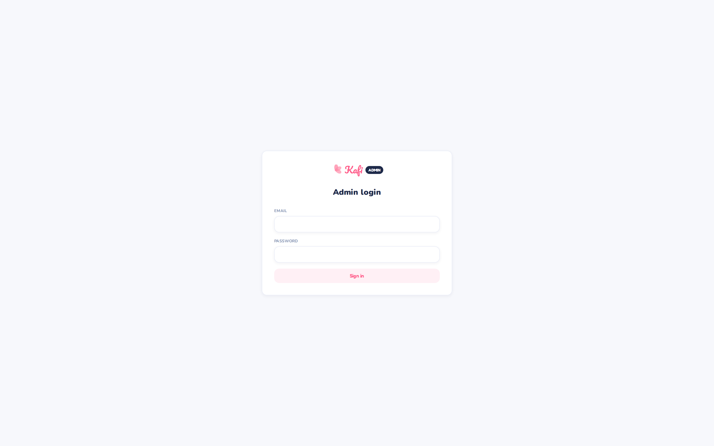

### 01-dashboard
Dashboard — KPIs, document verification queue, subscriptions, breakdowns

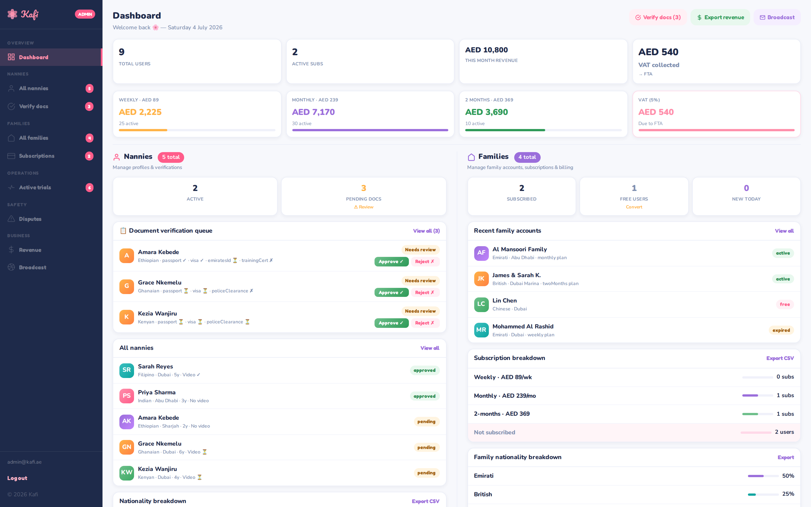

### 02-nannies
All nannies

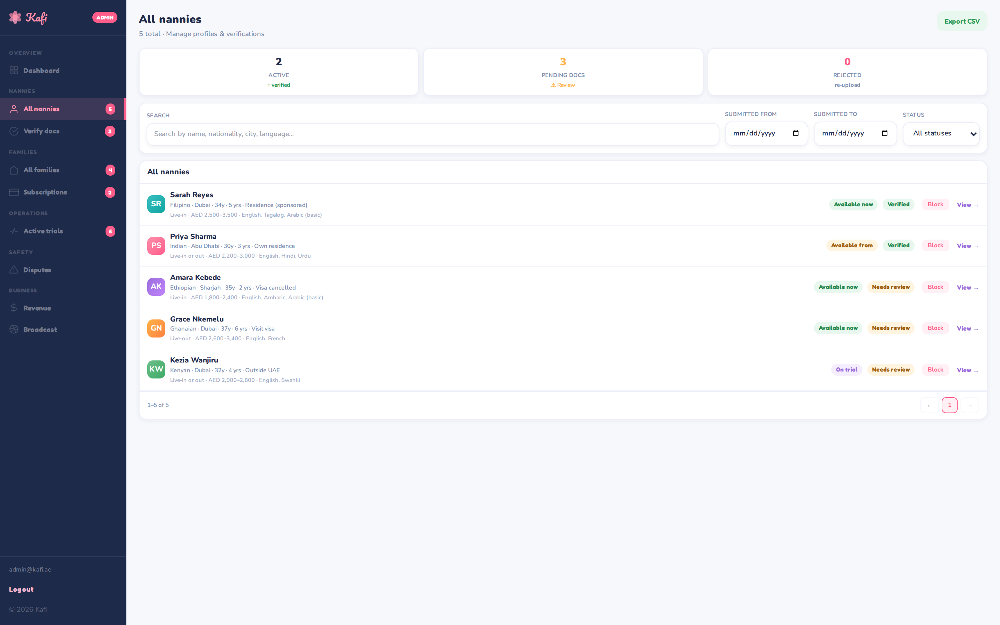

### 03-verify-documents
Verify documents queue (approve/reject per document)

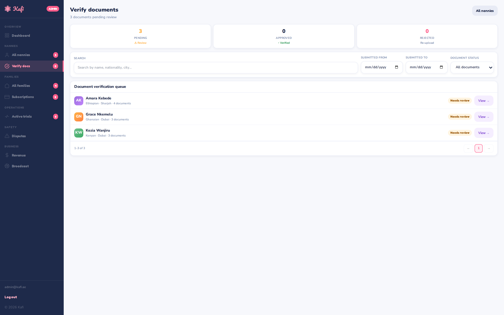

### 04-nanny-detail
Nanny detail — full profile + review actions

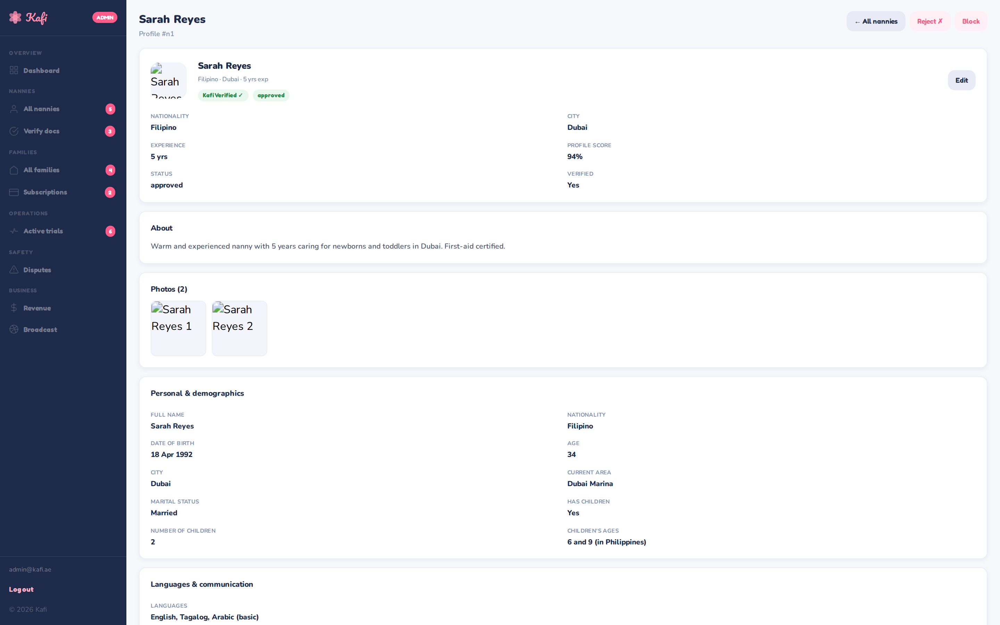

### 05-families
All families

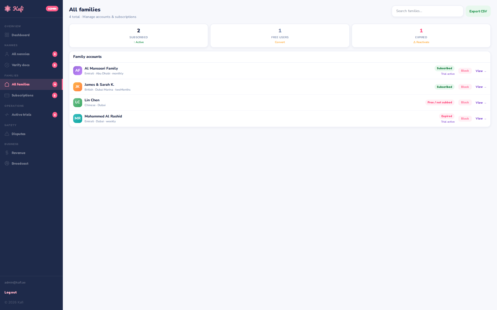

### 06-subscriptions
Subscriptions

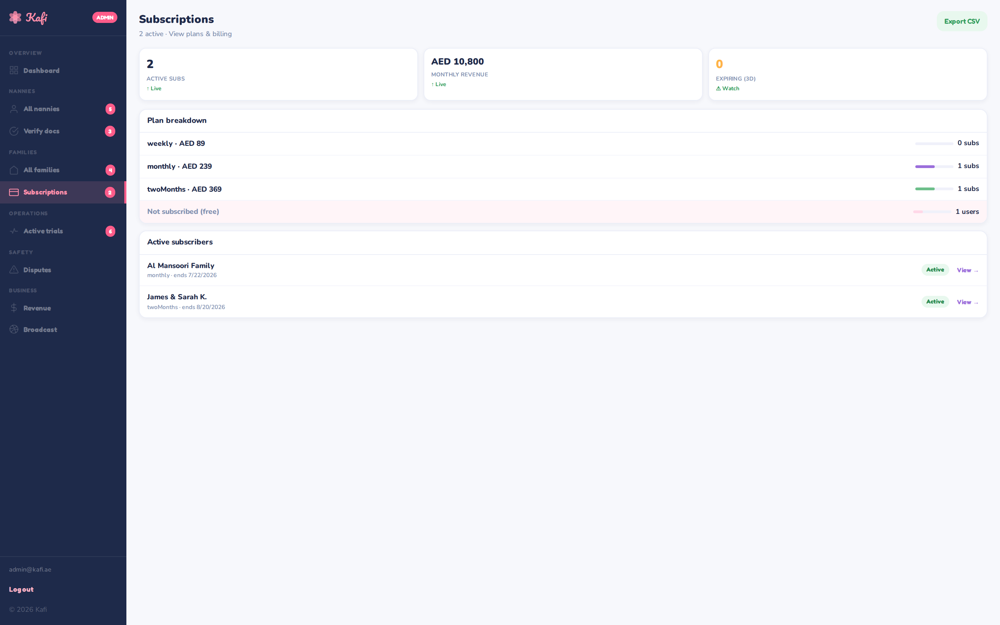

### 07-family-detail
Family detail

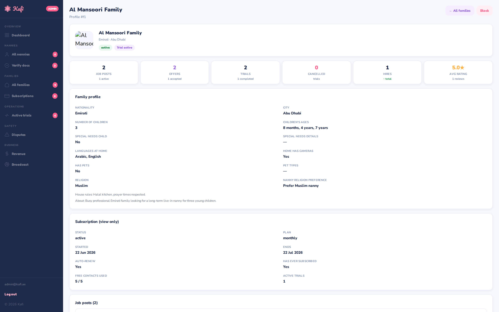

### 08-trials
All trials

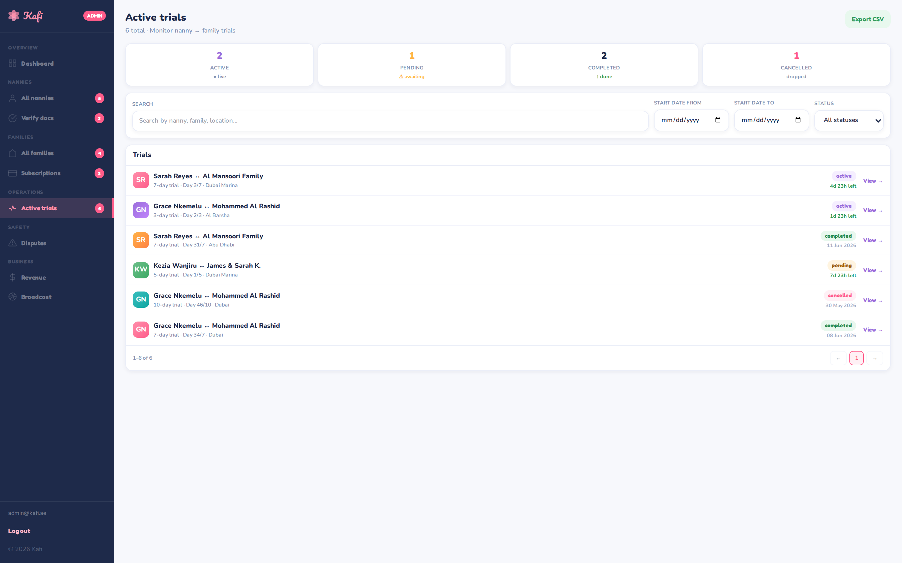

### 09-trial-detail
Trial detail

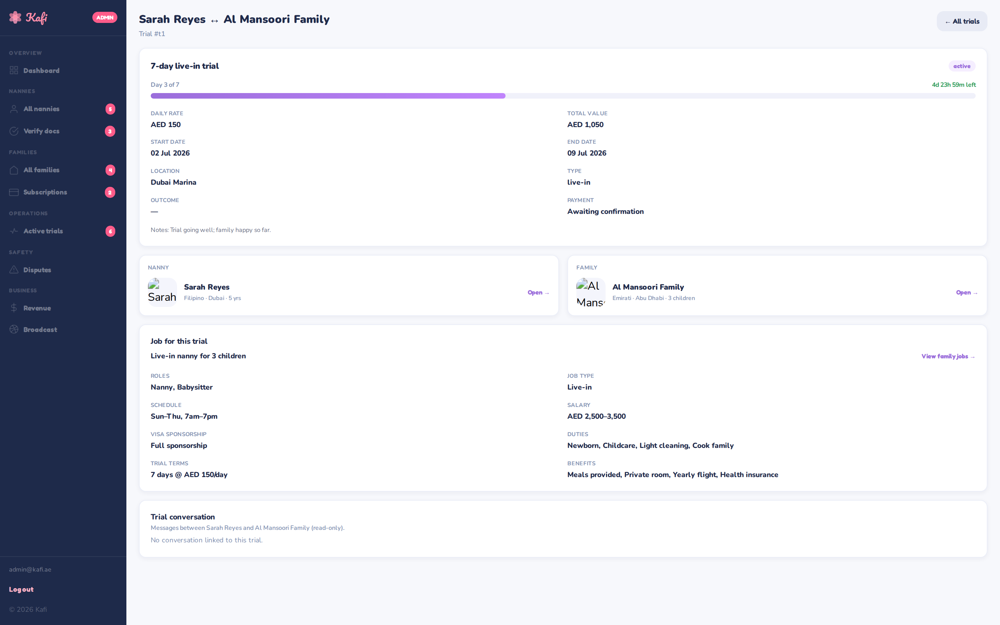

### 10-disputes
Disputes

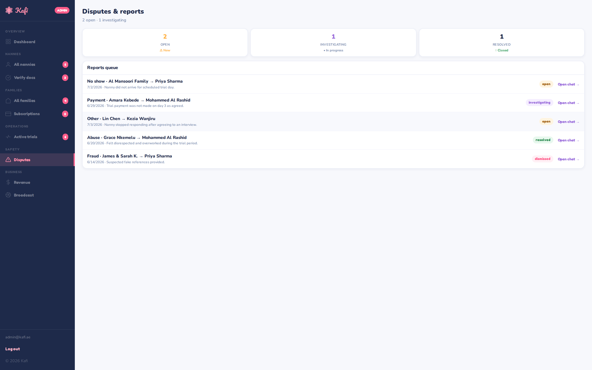

### 11-dispute-detail
Dispute detail

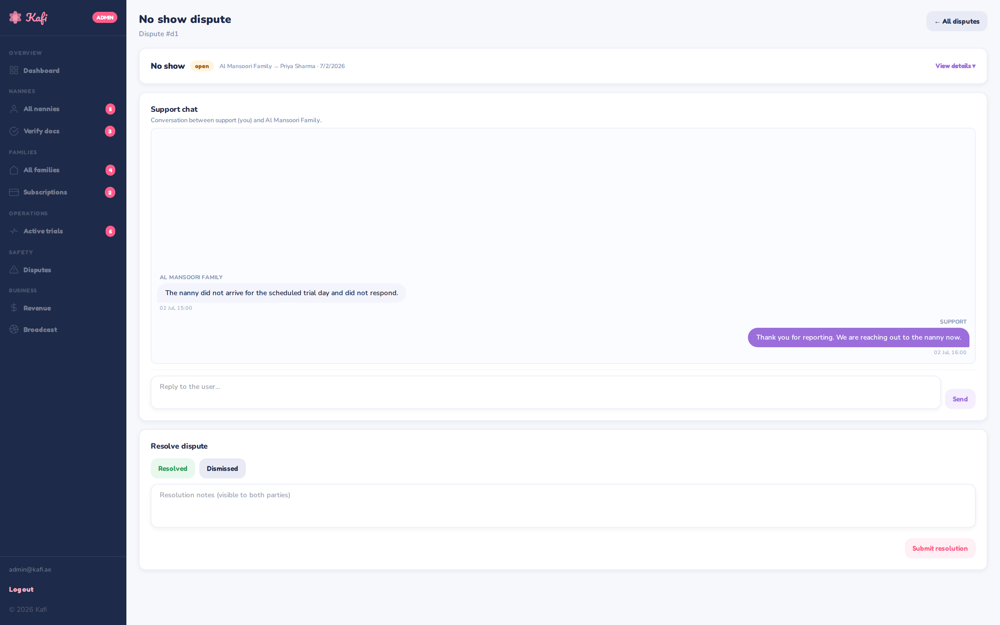

### 12-revenue
Revenue

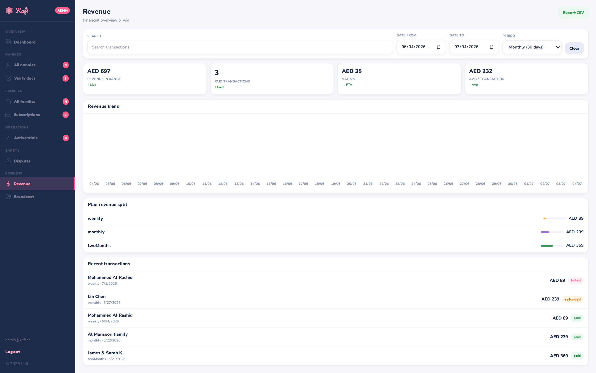

### 13-broadcast
Broadcast

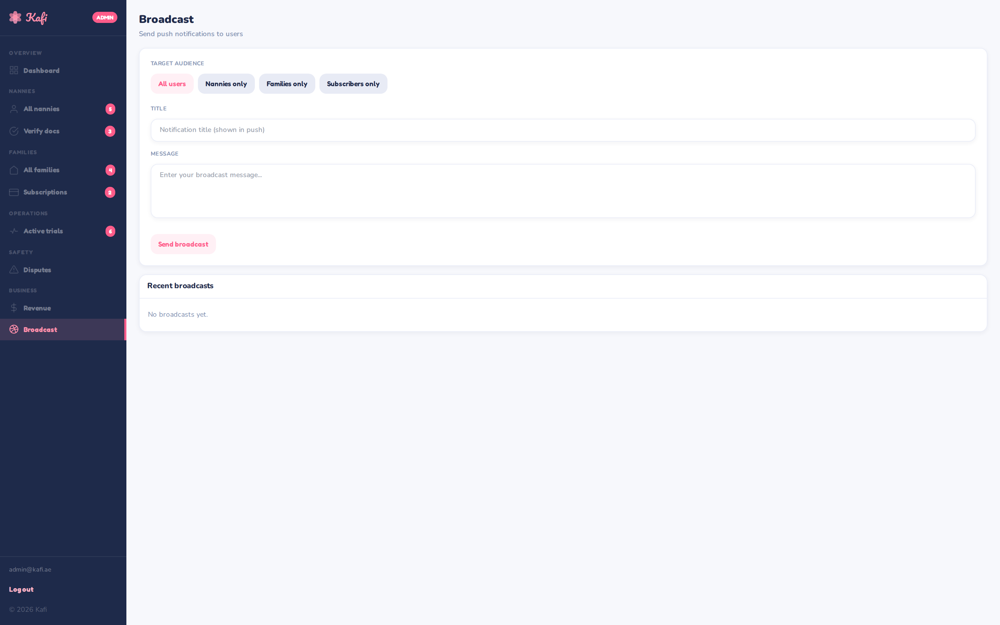

