# Kafi Mobile App — Screen Gallery (mock mode)

Every screen of the Flutter mobile app, captured screen-by-screen. Built as Flutter web (`useMock = true`) and driven headlessly.

**37 screens.** Captured in **mock mode** (`useMock = true`) — seeded demo data, no live backend. Images are full-height so scrollable screens show every field.

| # | Screen | Preview |
| --- | --- | --- |
| 1 | **01-welcome** — Welcome — role selection (Nanny vs Family) | [view](./01-welcome.png) |
| 2 | **02-login-nanny** — Nanny phone login (country code + OTP notice) | [view](./02-login-nanny.png) |
| 3 | **03-login-family** — Family phone login | [view](./03-login-family.png) |
| 4 | **04-otp-verify** — OTP verification — 6-digit code, resend, expiry timer | [view](./04-otp-verify.png) |
| 5 | **05-create-password** — Create password (post-OTP) — strength meter + confirm | [view](./05-create-password.png) |
| 6 | **06-password-reset** — Password reset flow | [view](./06-password-reset.png) |
| 7 | **07-nanny-info** — Nanny onboarding — About you (all required fields) | [view](./07-nanny-info.png) |
| 8 | **08-nanny-media** — Nanny onboarding — Photos & intro video | [view](./08-nanny-media.png) |
| 9 | **09-nanny-exp** — Nanny onboarding — Work experience | [view](./09-nanny-exp.png) |
| 10 | **10-nanny-refs** — Nanny onboarding — References | [view](./10-nanny-refs.png) |
| 11 | **11-nanny-docs** — Nanny onboarding — Documents (passport/visa/EID…) | [view](./11-nanny-docs.png) |
| 12 | **12-nanny-pending** — Nanny — Review/approval status + document status list | [view](./12-nanny-pending.png) |
| 13 | **13-nanny-home** — Nanny — Dashboard (Home tab) | [view](./13-nanny-home.png) |
| 14 | **14-nanny-applications** — Nanny — My applications | [view](./14-nanny-applications.png) |
| 15 | **15-nanny-edit-profile** — Nanny — Edit profile | [view](./15-nanny-edit-profile.png) |
| 16 | **16-smart-match** — Smart match — opens from a job; direct route shows the empty/placeholder state | [view](./16-smart-match.png) |
| 17 | **17-family-form** — Family onboarding — Job & family form (all required fields) | [view](./17-family-form.png) |
| 18 | **18-family-edit** — Family — Edit profile | [view](./18-family-edit.png) |
| 19 | **19-browse** — Family — Browse nannies (Home tab, ranked match cards) | [view](./19-browse.png) |
| 20 | **20-family-applicants** — Family — Applicants inbox (received applications) | [view](./20-family-applicants.png) |
| 21 | **21-shortlist** — Family — Shortlist | [view](./21-shortlist.png) |
| 22 | **22-profile-locked** — Contact locked (paywall) | [view](./22-profile-locked.png) |
| 23 | **23-profile-relocked** — Contact re-locked | [view](./23-profile-relocked.png) |
| 24 | **24-profile-unlocked** — Contact unlocked | [view](./24-profile-unlocked.png) |
| 25 | **25-trial** — Trial screen | [view](./25-trial.png) |
| 26 | **26-trial-offer** — Trial offer | [view](./26-trial-offer.png) |
| 27 | **27-pricing** — Pricing / subscription plans | [view](./27-pricing.png) |
| 28 | **28-notifications** — Notifications | [view](./28-notifications.png) |
| 29 | **29-terms** — Terms & Conditions | [view](./29-terms.png) |
| 30 | **30-privacy** — Privacy Policy | [view](./30-privacy.png) |
| 31 | **31-delete-account** — Delete account | [view](./31-delete-account.png) |
| 32 | **32-compare** — Compare nannies — opens with a selection; direct route is partial | [view](./32-compare.png) |
| 33 | **33-nanny-job-detail** — Job detail — opens from a job card; direct route shows the empty state | [view](./33-nanny-job-detail.png) |
| 34 | **34-family-messages** — Family — Messages tab (chat threads) | [view](./34-family-messages.png) |
| 35 | **35-family-settings** — Family — Profile/Settings tab | [view](./35-family-settings.png) |
| 36 | **36-nanny-jobs** — Nanny — Jobs tab | [view](./36-nanny-jobs.png) |
| 37 | **38-nanny-settings** — Nanny — Profile/Settings tab | [view](./38-nanny-settings.png) |

---

### 01-welcome
Welcome — role selection (Nanny vs Family)

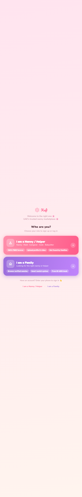

### 02-login-nanny
Nanny phone login (country code + OTP notice)

### 03-login-family
Family phone login

### 04-otp-verify
OTP verification — 6-digit code, resend, expiry timer

### 05-create-password
Create password (post-OTP) — strength meter + confirm

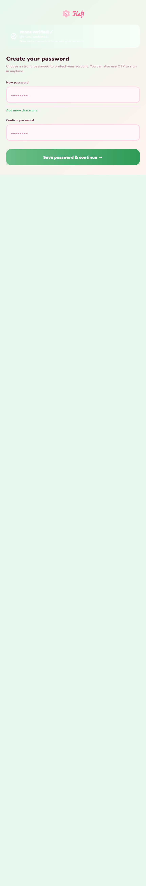

### 06-password-reset
Password reset flow

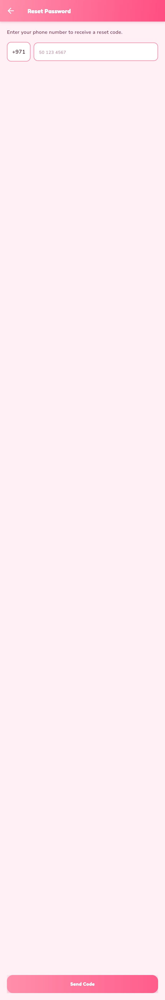

### 07-nanny-info
Nanny onboarding — About you (all required fields)

### 08-nanny-media
Nanny onboarding — Photos & intro video

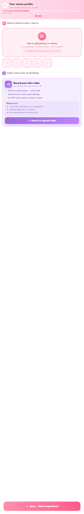

### 09-nanny-exp
Nanny onboarding — Work experience

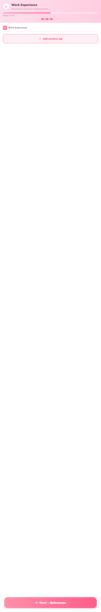

### 10-nanny-refs
Nanny onboarding — References

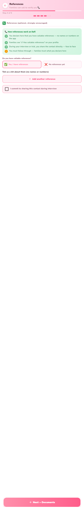

### 11-nanny-docs
Nanny onboarding — Documents (passport/visa/EID…)

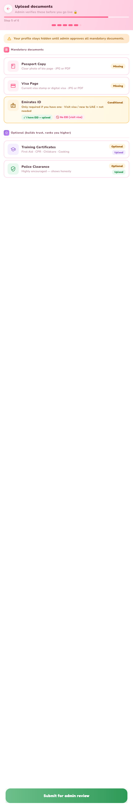

### 12-nanny-pending
Nanny — Review/approval status + document status list

### 13-nanny-home
Nanny — Dashboard (Home tab)

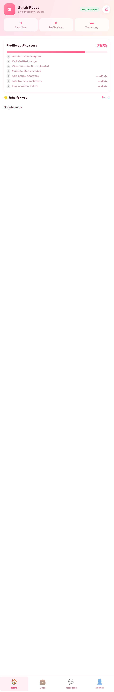

### 14-nanny-applications
Nanny — My applications

### 15-nanny-edit-profile
Nanny — Edit profile

### 16-smart-match
Smart match — opens from a job; direct route shows the empty/placeholder state

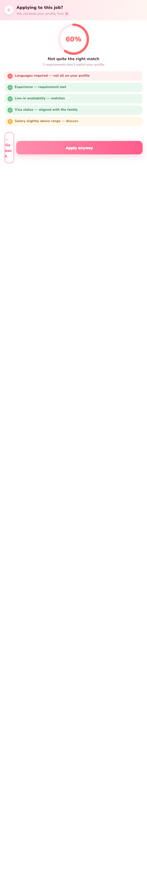

### 17-family-form
Family onboarding — Job & family form (all required fields)

### 18-family-edit
Family — Edit profile

### 19-browse
Family — Browse nannies (Home tab, ranked match cards)

### 20-family-applicants
Family — Applicants inbox (received applications)

### 21-shortlist
Family — Shortlist

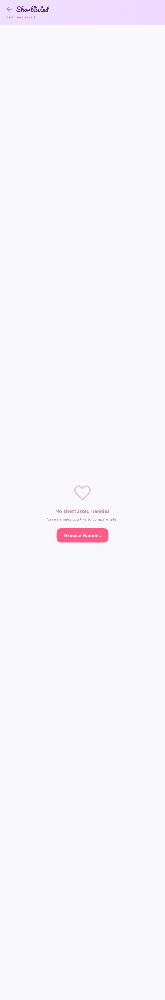

### 22-profile-locked
Contact locked (paywall)

### 23-profile-relocked
Contact re-locked

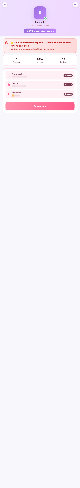

### 24-profile-unlocked
Contact unlocked

### 25-trial
Trial screen

### 26-trial-offer
Trial offer

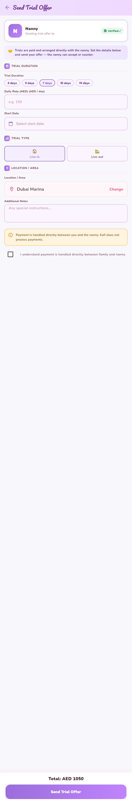

### 27-pricing
Pricing / subscription plans

### 28-notifications
Notifications

### 29-terms
Terms & Conditions

### 30-privacy
Privacy Policy

### 31-delete-account
Delete account

### 32-compare
Compare nannies — opens with a selection; direct route is partial

### 33-nanny-job-detail
Job detail — opens from a job card; direct route shows the empty state

### 34-family-messages
Family — Messages tab (chat threads)

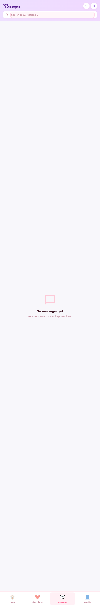

### 35-family-settings
Family — Profile/Settings tab

### 36-nanny-jobs
Nanny — Jobs tab

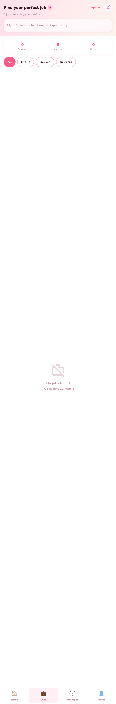

### 38-nanny-settings
Nanny — Profile/Settings tab

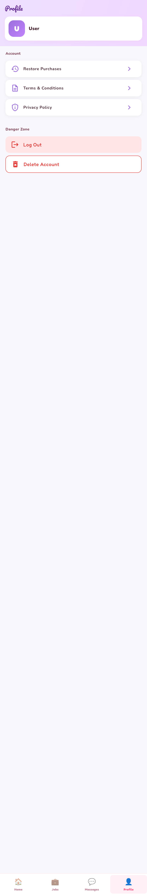

