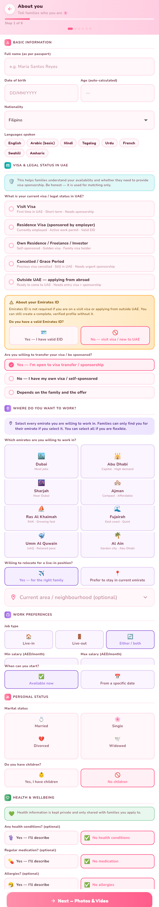
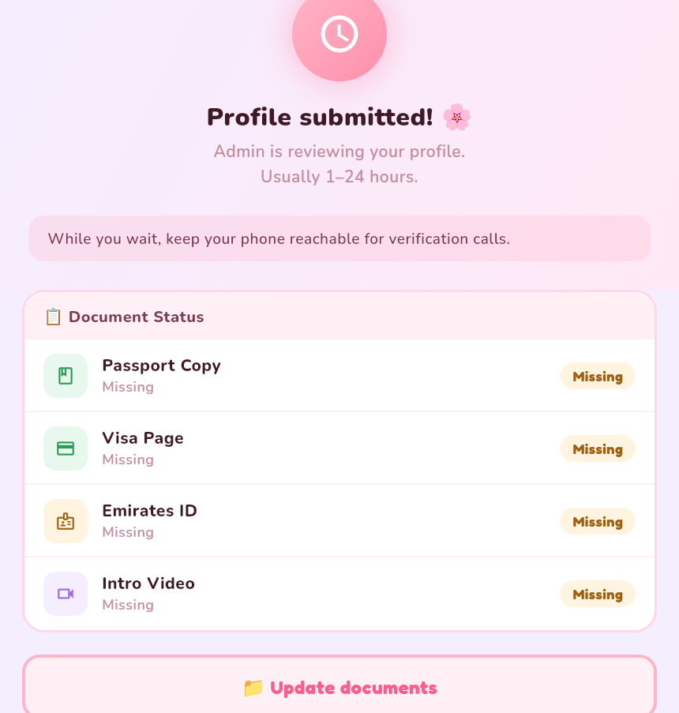
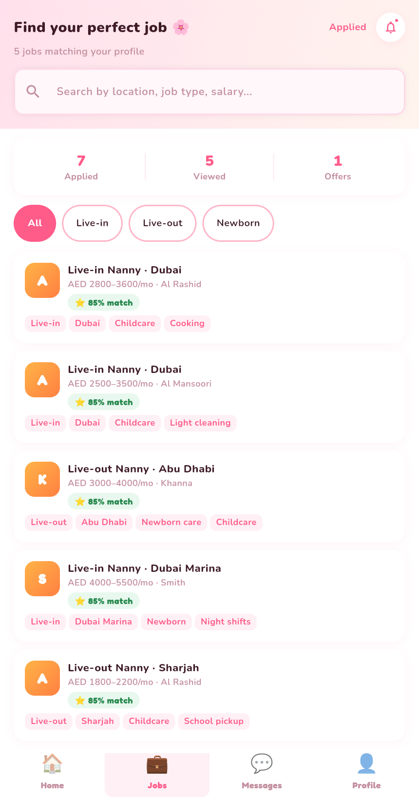
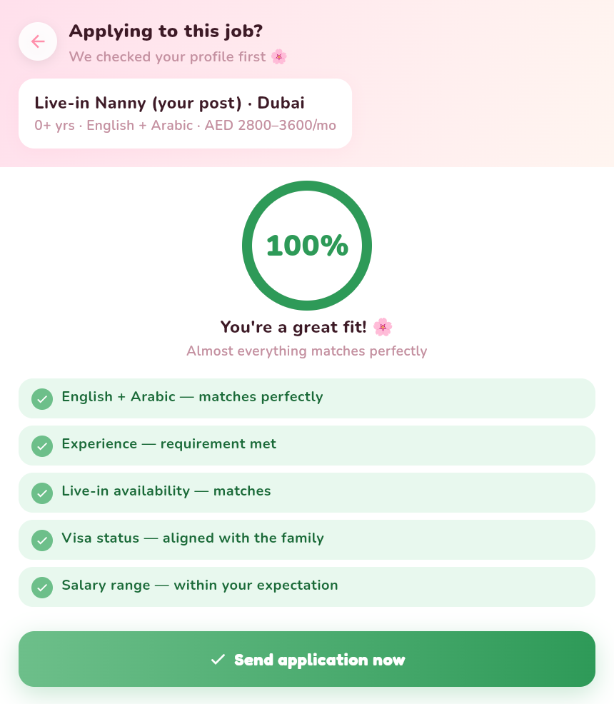
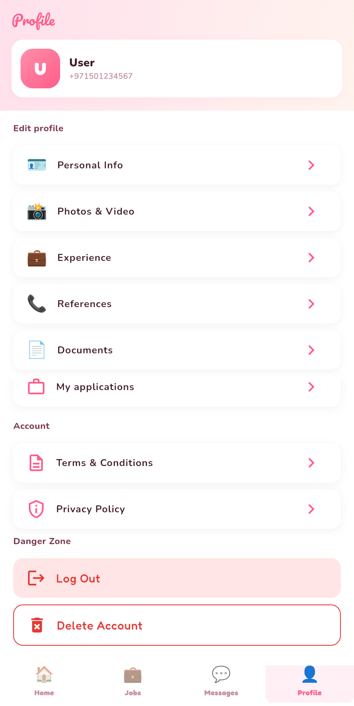

# Kafi — Nanny Flow (mock mode)

The complete **nanny** journey, in order — signup, onboarding, review, then the approved-nanny app (dashboard, jobs, applying, messages, profile). Captured in mock mode with a seeded **approved** demo nanny so every screen shows real data.

**15 screens.** Full-height, content-cropped images.

### 01-login
Nanny phone login (country code + OTP notice).

### 02-about-you
Onboarding — About you (all required fields).

### 03-photos-video
Onboarding — Photos & intro video.

### 04-experience
Onboarding — Work experience.

### 05-references
Onboarding — References.

### 06-documents
Onboarding — Documents (passport / visa / EID…).

### 07-pending-review
Submitted — review/approval status + per-document status.

### 08-dashboard
Dashboard — stats, profile-quality score, matched jobs.

### 09-jobs
Jobs tab — matching job posts.

### 10-job-detail
Job detail — match breakdown, schedule, salary, duties, visa.

### 11-smart-match
Smart match — pre-apply fit check.

### 12-my-applications
My applications — Pending / Viewed / Shortlisted / Trial / Hired.

### 13-messages
Messages.

### 14-edit-profile
Edit profile.

### 15-settings
Profile / Settings (edit sections + My applications).

