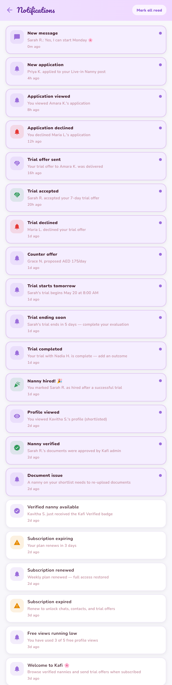

# Kafi — Shared Screens (mock mode)

Screens common to both flows — the entry/auth screens and shared utilities.

**8 screens.** Full-height, content-cropped images.

### 01-welcome
Welcome — choose role (Nanny vs Family).

### 02-otp-verify
OTP verification — 6-digit, resend, expiry timer.

### 03-create-password
Create password (post-OTP) — strength + confirm.

### 04-password-reset
Password reset.

### 05-notifications
Notifications inbox (messages, applications, trials, subscription).

### 06-terms
Terms & Conditions.

### 07-privacy
Privacy Policy.

### 08-delete-account
Delete account.

